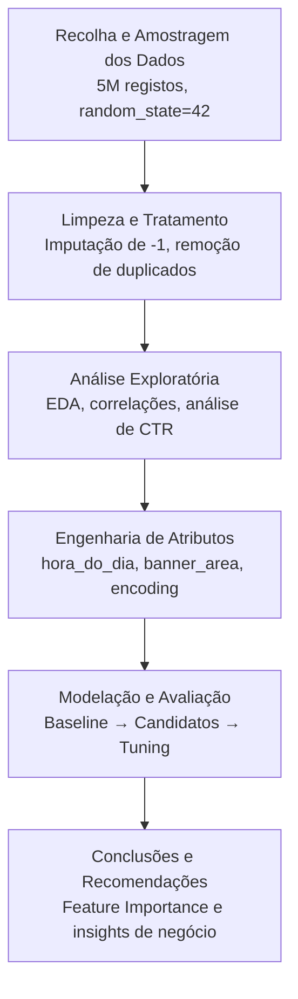

# Milestone 1: Iniciação e Entendimento do Negócio

## 1. Descrição do Problema

A publicidade digital representa hoje um dos maiores mercados globais, onde o sucesso depende da precisão com que se prevê o comportamento do utilizador. Grande parte dos anúncios exibidos em aplicações e sites são decididos através de leilões instantâneos (*Real-Time Bidding*), nos quais a estimativa da Taxa de Clique (CTR — Click-Through Rate) é a métrica central. Para os anunciantes, prever esta probabilidade é essencial para otimizar o investimento e reduzir o desperdício em impressões irrelevantes; para as plataformas, é a chave para maximizar a receita.

Este projeto aborda precisamente esse desafio utilizando o dataset Avazu CTR Prediction. Composto por dados reais de publicidade móvel recolhidos ao longo de 10 dias, o conjunto de dados inclui cerca de 40 milhões de registos e 24 variáveis contextuais — como o tipo de dispositivo, posição do anúncio e ambiente de navegação. Do ponto de vista da ciência de dados, enfrentamos um problema de classificação binária supervisionada, onde o objetivo é prever a variável click.

O maior desafio identificado reside no forte desequilíbrio das classes: apenas cerca de 17% dos dados correspondem a cliques reais. Este cenário torna a previsão complexa, uma vez que modelos simplistas poderiam apresentar uma precisão elevada sem possuírem qualquer utilidade prática. Por isso, o tratamento deste desbalanceamento e a seleção rigorosa de métricas como o AUC-ROC foram decisões fundamentais para garantir a eficácia e o valor de negócio da solução desenvolvida.

## 2. Objetivos SMART

1. **Objetivo 1:** Desenvolver um modelo de classificação binária capaz de prever se um utilizador irá clicar num anúncio, atingindo um **AUC-ROC mínimo de 0.75** no conjunto de teste, utilizando o *dataset* Avazu CTR Prediction até ao final do Milestone 3.

2. **Objetivo 2:** Identificar as **5 variáveis mais determinantes** para a previsão do clique (através de *Feature Importance*) e diagnosticar os perfis de erro do modelo, fornecendo recomendações acionáveis sobre os contextos de anúncios com maior probabilidade de conversão, até à conclusão da fase de modelação.

## 3. Perguntas de Investigação
Que variáveis contextuais — características do dispositivo, hora do dia, posição do anúncio ou categoria do site — têm maior peso na decisão de clique, e como esse peso se traduz em valor para a otimização de lances em RTB?

De que forma o forte desequilíbrio entre cliques (~17%) e não-cliques (~83%) afeta a capacidade preditiva dos modelos testados, e qual a estratégia mais eficaz para o mitigar sem introduzir data leakage?

O modelo consegue identificar perfis de utilizador ou contextos de exibição com probabilidade de clique sistematicamente acima ou abaixo da média global — e que implicação prática teria esse conhecimento para um anunciante?

## 4. Metodologia de Gestão (PBL)

* **Divisão de Tarefas:**
  * **Bernardo:** Responsável pela Engenharia de dados, pré-processamento e feature engineering.
  * **Hugo:** Responsável pela Modelação, otimização de hiperparâmetros e avaliação de modelos.

## 5. Entendimento dos Dados (Data Understanding)
### Fonte e Proveniência

* **Origem:** Dataset público disponibilizado pela Avazu no Kaggle —
[Avazu CTR Prediction](https://www.kaggle.com/competitions/avazu-ctr-prediction)
* **Período de Extração:** Dados recolhidos entre outubro e novembro de 2014
(10 dias de logs de impressões de anúncios mobile).
* **Disponibilidade:** Dataset disponível diretamente no Kaggle. Por limitações de
memória RAM (40,4 milhões de registos), foi adotada uma **amostra aleatória de
5.000.000 registos** com semente fixa (`random_state=42`), por sugestão da
professora, garantindo reprodutibilidade e representatividade estatística.
* **Qualidade Inicial:** O dataset não apresenta valores nulos convencionais. Os dados
em falta estão mascarados como `-1` nas colunas anónimas (C14–C21), em particular
na coluna `C20`, que concentra a maioria das omissões. Esta situação será tratada
na Milestone 2 através de imputação pela moda.
* **Ética:** O dataset é totalmente anonimizado — os identificadores de utilizador
(`device_id`, `device_ip`) são hashes sem correspondência a dados pessoais
identificáveis. Não existem implicações de RGPD dado tratar-se de dados públicos
de competição.

### Dicionário de Variáveis (Metadados)

| Variável | Tipo de Dado | Descrição | Importância Esperada |
| :--- | :--- | :--- | :--- |
| `id` | Alfanumérico | Identificador único do registo (anonimizado) | Nula (apenas identificação) |
| `click` | Binário (0/1) | **Variável Alvo** — indica se o anúncio foi clicado | Muito Alta |
| `hour` | Numérico | Data e hora da impressão (formato YYMMDDhh) | Alta (padrões temporais) |
| `C1` | Categórico Anónimo | Variável anonimizada pela Avazu | Média |
| `banner_pos` | Numérico | Posição do banner na página | Alta |
| `site_id` | Categórico | Identificador do site onde o anúncio foi exibido | Alta |
| `site_domain` | Categórico | Domínio do site | Alta |
| `site_category` | Categórico | Categoria temática do site | Alta |
| `app_id` | Categórico | Identificador da aplicação mobile | Alta |
| `app_domain` | Categórico | Domínio da aplicação | Média |
| `app_category` | Categórico | Categoria da aplicação mobile | Alta |
| `device_id` | Alfanumérico | Identificador do dispositivo (hash anonimizado) | Média |
| `device_ip` | Alfanumérico | Endereço IP do dispositivo (hash anonimizado) | Baixa |
| `device_model` | Categórico | Modelo do dispositivo | Média |
| `device_type` | Numérico | Tipo de dispositivo (ex: smartphone, tablet) | Alta |
| `device_conn_type` | Numérico | Tipo de ligação à internet (ex: WiFi, 4G) | Alta |
| `C14`–`C21` | Categórico Anónimo | Variáveis anonimizadas pela Avazu (contexto do anúncio) | Alta (C14, C16, C17) |

## 6. Planeamento da Abordagem

O projeto segue a metodologia **CRISP-DM**, estruturada nas quatro Milestones da unidade
curricular:

*Data de última atualização: 23/04/2026*
