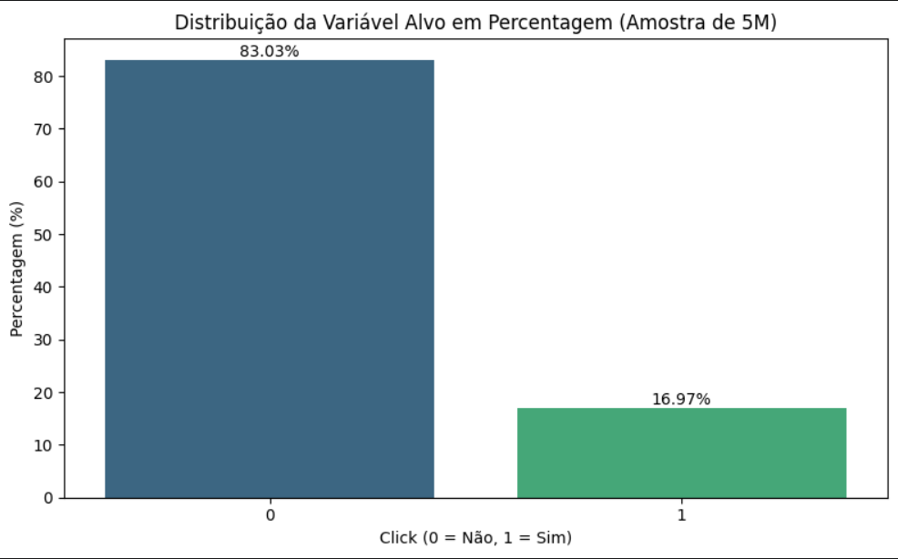
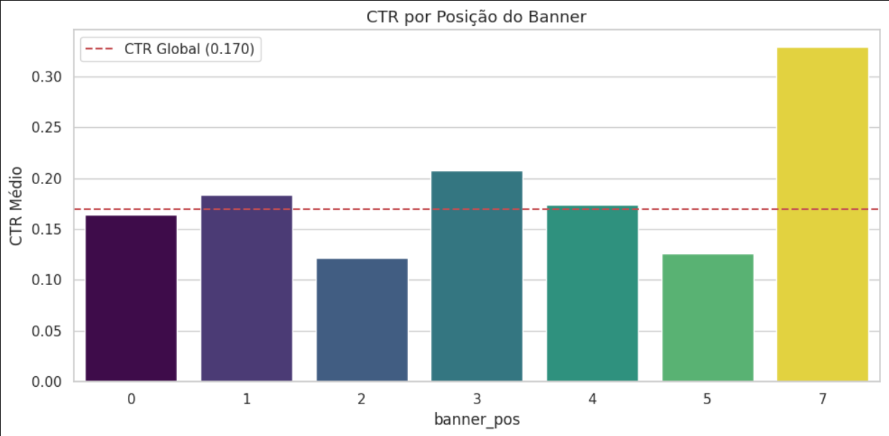
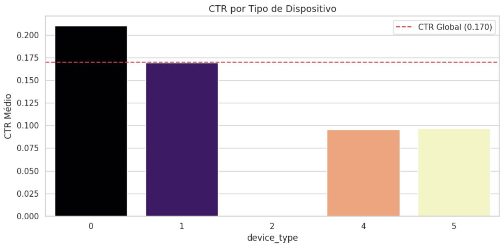
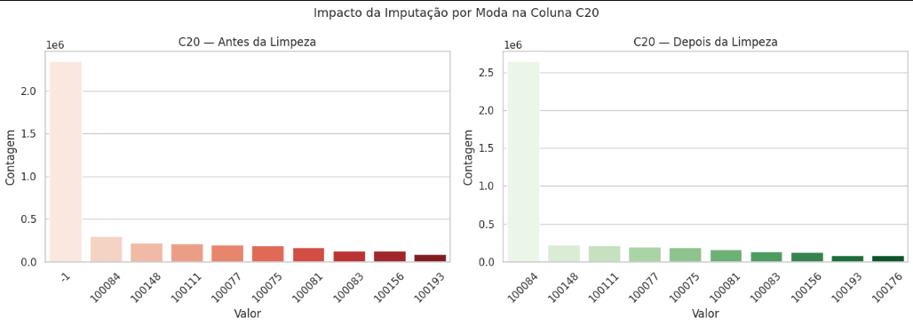

# *Milestone* 2: Análise Exploratória e Engenharia de Atributos

> **Nota:** Este documento pressupõe que o *dataset* já foi identificado e descrito no ficheiro `docs/M1_iniciacao.md`. O dicionário de variáveis original encontra-se nessa secção.

*Data de última atualização: Março 2026*

## 1. Análise Exploratória de Dados (EDA)

### 1.1. Distribuição da Variável Alvo

A variável alvo `click` é binária e está fortemente desequilibrada. Na amostra de 5 milhões de registos, 4.151.406 são não-cliques (83,03%) e 848.594 são cliques (16,97%), com um rácio de aproximadamente 1:5.

Este desequilíbrio tem uma consequência direta: um modelo que previsse sempre "não clique" teria 83% de *accuracy* sem qualquer utilidade preditiva — fenómeno conhecido como *accuracy paradox* (Japkowicz & Stephen, 2002). Por isso, definimos o AUC-ROC como métrica principal e o F1-Score como métrica secundária, por serem robustas ao desequilíbrio de classes. A *Accuracy* foi excluída da avaliação.

### 1.2. Correlações Relevantes e Três Conclusões Visuais

Gerámos uma matriz de correlação de Pearson entre as variáveis numéricas e a variável alvo, bem como gráficos de dispersão (*scatter plots*) do CTR por variável. As três conclusões visuais mais relevantes foram:

**Conclusão 1 — O CTR varia significativamente com a hora do dia.** A análise bivariada mostra que as primeiras horas da madrugada (0h–3h) têm CTR acima da média global de 16,97%, o que contraria a intuição inicial. Isto motivou a criação da variável `hora_do_dia`. Ver figura: `reports/figures/eda_ctr_hora_dia.png`

**Conclusão 2 — A variável C16 tem a correlação mais forte com `click` (r = +0,1303).** As variáveis anónimas C14, C15 e C16 são as mais correlacionadas com a variável alvo — valores positivos para C16 e negativos para C14 e C17. Isto sugere que representam características do anúncio com impacto direto na decisão de clique. Encontrámos também um par com multicolinearidade elevada: C14 e C17 têm correlação de Pearson r = 0,9769, acima do limiar de 0,95 que definimos para remoção.

**Conclusão 3 — A posição do *banner* (`banner_pos`) e o tipo de dispositivo influenciam o CTR.** A posição 0 concentra a maioria das impressões mas não tem o CTR mais alto. Dispositivos diferentes mostram padrões de clique distintos, o que motivou a criação de `banner_area` como medida de impacto visual do anúncio. Ver figuras:,

---

## 2. Qualidade dos Dados e Limpeza

### 2.1. Tratamento de Dados em Falta (*Missing Data*)

Não existem valores nulos explícitos (`NaN`) em nenhuma das 24 colunas. No entanto, o *dataset* Avazu usa o valor `-1` como código para informação desconhecida nas colunas anónimas C14–C21 — uma prática comum em sistemas de registo de publicidade (He et al., 2014).

Analisámos a percentagem de valores `-1` em cada coluna e definimos um limiar de 1%: colunas com menos de 1% de valores `-1` foram consideradas limpas; acima disso, imputámos pela moda.

A coluna mais crítica foi `C20`, com 2.344.248 valores `-1` (46,88% da amostra). Optámos por imputação pela moda (valor mais frequente: 100084) em vez da média ou mediana porque `C20` é uma variável categórica codificada numericamente — calcular a média de identificadores de categoria não tem sentido lógico, e a moda preserva a natureza discreta da variável. As restantes colunas anónimas tinham percentagens abaixo de 1% e não foram alteradas.

Além disso, verificámos a existência de **observações repetidas**:

- Linhas totalmente duplicadas: **0 registos** — nenhuma remoção necessária.
- Duplicados lógicos (mesmo `device_ip`, `device_id`, `hour`, `site_id`, `app_id`): **1.130.966 registos (22,62%)** — mantidos porque em contexto de *Real-Time Bidding* é normal o mesmo utilizador ser exposto ao mesmo anúncio várias vezes. Remover estes registos eliminaria informação real sobre frequência de exposição.

### 2.2. Outliers e Inconsistências

Identificámos *outliers* nas variáveis numéricas usando o método do Intervalo Interquartil (IQR), que define como atípicos os valores fora do intervalo [Q1 − 1,5×IQR, Q3 + 1,5×IQR]. Escolhemos este método em vez de critérios baseados no desvio padrão porque não assume distribuição Normal — mais adequado para as variáveis discretas e assimétricas do Avazu.

As colunas com maior percentagem de *outliers* foram C19 (18,02%), C21 (14,27%), `device_conn_type` (13,66%) e C17 (8,47%). Optámos por **não remover** nenhum destes valores porque se trata de comportamentos reais de utilizadores — não são erros de medição. Além disso, os algoritmos que vamos usar na modelação (*Random Forest* e *XGBoost*) são naturalmente robustos a *outliers* por serem baseados em árvores de decisão.

Verificámos também os tipos de dados e confirmámos que todos estão conformes com a documentação do *dataset*, com exceção de `id` que é `uint64` em vez de `float64` — diferença sem impacto prático uma vez que esta coluna é removida no pré-processamento.

---

## 3. Engenharia de Atributos (*Feature Engineering*)

### 3.1. Transformações Realizadas

**Encoding das variáveis categóricas — *Frequency Encoding***

As colunas categóricas de alta cardinalidade (`site_id`, `site_domain`, `site_category`, `app_id`, `app_domain`, `app_category`, `device_model`) foram transformadas usando *Frequency Encoding*: cada categoria é substituída pela sua frequência relativa no conjunto de treino.

Optámos por *Frequency Encoding* em vez de *Label Encoding* porque o *Label Encoding* atribui inteiros sequenciais às categorias, criando uma falsa relação ordinal — o modelo assumiria que `site_id=500` está "entre" 499 e 501, o que não tem qualquer significado. O *Frequency Encoding* preserva informação real (categorias mais frequentes têm valores mais altos) sem introduzir ordinalidade artificial.

Importante: o *Frequency Encoding* foi calculado **exclusivamente sobre o conjunto de treino** e depois aplicado ao conjunto de teste. Categorias que só aparecem no teste recebem frequência 0. Esta ordem é fundamental para evitar *data leakage* — se calculássemos as frequências sobre todo o *dataset* antes de dividir, o conjunto de teste estaria a "contaminar" o treino.

**Escalonamento — *StandardScaler***

O *StandardScaler* foi aplicado às variáveis numéricas no contexto da Regressão Logística (*baseline*), transformando cada variável para média 0 e desvio padrão 1. Tal como o *encoding*, o *scaler* foi ajustado apenas no treino e aplicado ao teste, para garantir o isolamento do conjunto de avaliação.

**Remoção de variáveis não preditivas**

Removemos `id`, `device_id` e `device_ip` por serem identificadores individuais sem poder preditivo — têm cardinalidade próxima do número total de registos e não generalizam para dados novos. A coluna `hour` foi removida após a extração de `hora_do_dia`.

**Remoção por multicolinearidade**

Após o *encoding*, detectámos que C14 e C17 têm correlação de Pearson r = 0,9769, acima do limiar de 0,95 que definimos. Manter variáveis tão correlacionadas não acrescenta informação ao modelo e pode introduzir instabilidade. Removemos as colunas com correlação acima do limiar (`site_domain`, `app_category`, `C17`, `visibilidade_anuncio`) de ambos os conjuntos (treino e teste). O *dataset* final ficou com 18 variáveis.

### 3.2. Criação de Novos Atributos

Criámos três novas variáveis a partir das existentes e verificámos a sua correlação com `click` antes de as incluir no *pipeline*:

**`hora_do_dia`** — extraída de `hour` com `hour % 100`. A variável original está em formato YYMMDDHH, pelo que os dois últimos dígitos correspondem à hora do dia (0–23). A análise bivariada confirmou que o CTR varia ao longo do dia, tornando esta variável relevante para o modelo.

**`banner_area`** — calculada como C15 × C16. Assumimos que C15 e C16 representam largura e altura do *banner* em píxeis, o que é suportado pelos seus valores únicos (120, 216, 300, 320, 480, 728, 768, 1024 — dimensões standard de *banners* publicitários). A área do *banner* é uma medida de impacto visual mais direta do que as dimensões isoladas.

**`visibilidade_anuncio`** — calculada como `(banner_pos + 1) / log1p(banner_area)`. Combina a posição do anúncio na página com a sua dimensão. Usámos `banner_pos + 1` para evitar que posições com valor 0 (topo da página) anulem a variável, e `log1p` para suavizar o efeito de áreas muito grandes. A correlação desta variável com `click` foi verificada antes da inclusão.

---

## 4. Dicionário de Dados Final (Pós-Processamento)

Listagem das variáveis entregues ao modelo na Fase 3. O *dataset* processado tem **5.000.000 registos × 18 colunas** e foi guardado em `data/processed/`.

| Atributo | Tipo | Descrição | Transformação |
| :--- | :--- | :--- | :--- |
| `click` | Inteiro (binário) | **Variável alvo** — 1: clique; 0: não clique | Nenhuma |
| `C1` | Inteiro | Variável anónima de contexto | Nenhuma |
| `banner_pos` | Inteiro | Posição do anúncio na página | Nenhuma |
| `site_id` | *Float* | Identificador do *site* | *Frequency Encoding* |
| `site_category` | *Float* | Categoria temática do *site* | *Frequency Encoding* |
| `app_id` | *Float* | Identificador da aplicação | *Frequency Encoding* |
| `app_domain` | *Float* | Domínio da aplicação | *Frequency Encoding* |
| `device_model` | *Float* | Modelo do dispositivo | *Frequency Encoding* |
| `device_type` | Inteiro | Tipo de dispositivo | Nenhuma |
| `device_conn_type` | Inteiro | Tipo de ligação à rede | Nenhuma |
| `C14` | Inteiro | Variável anónima | Nenhuma |
| `C15` | Inteiro | Variável anónima (largura do *banner*) | Nenhuma |
| `C16` | Inteiro | Variável anónima (altura do *banner*) | Nenhuma |
| `C18` | Inteiro | Variável anónima | Nenhuma |
| `C19` | Inteiro | Variável anónima | Nenhuma |
| `C20` | Inteiro | Variável anónima | Imputação pela moda (−1 → 100084) |
| `C21` | Inteiro | Variável anónima | Nenhuma |
| `hora_do_dia` | Inteiro | **Nova** — Hora extraída de `hour` (0–23) | `hour % 100` |
| `banner_area` | Inteiro | **Nova** — Área estimada do *banner* | C15 × C16 |
| `id` | — | Identificador único | **Removido** — sem poder preditivo |
| `device_id` | — | Identificador do dispositivo | **Removido** — sem poder preditivo |
| `device_ip` | — | Endereço IP do utilizador | **Removido** — sem poder preditivo |
| `hour` | — | Marcação temporal original | **Removido** — substituído por `hora_do_dia` |
| `site_domain` | — | Domínio do *site* | **Removido** — multicolinearidade (r > 0,95) |
| `app_category` | — | Categoria da aplicação | **Removido** — multicolinearidade (r > 0,95) |
| `C17` | — | Variável anónima | **Removido** — multicolinearidade com C14 (r = 0,9769) |
| `visibilidade_anuncio` | — | Índice de visibilidade | **Removido** — multicolinearidade (r > 0,95) |

---

## 5. Conclusões da Fase de Exploração

Esta fase permitiu passar de um *dataset* bruto com 24 colunas para um conjunto processado com 18 variáveis, pronto para a modelação. O que aprendemos de mais importante:

Os dados não têm nulos explícitos, mas a coluna `C20` tinha quase metade dos registos com o valor `-1` a mascarar informação em falta — algo que não era visível numa inspeção rápida e que poderia ter enviesado o modelo se não tivesse sido tratado.

O desequilíbrio de classes (83/17) é o facto mais condicionante de todo o projeto. Define a métrica de avaliação, obriga ao uso de pesos compensatórios nos algoritmos e exige estratificação em todas as divisões de dados.

As variáveis anónimas C14, C15 e C16 são as mais correlacionadas com `click`, o que sugere que representam características do anúncio — e não do utilizador ou do contexto de navegação. Isto é útil para interpretar os resultados da modelação.

As três novas variáveis criadas (`hora_do_dia`, `banner_area`) têm correlação verificada com `click` e introduzem informação que as variáveis originais não capturavam diretamente. A `visibilidade_anuncio` foi posteriormente removida por multicolinearidade.

O *dataset* processado está guardado em `data/processed/` e corre do início ao fim sem erros no *notebook* `1.0_eda_limpeza.ipynb`.

---

## Referências

He, X., Pan, J., Jin, O., Xu, T., Liu, B., Xu, T., Shi, Y., Atallah, A., Herbrich, R., Bowers, S., & Candela, J. Q. (2014). Practical lessons from predicting clicks on ads at Facebook. *Proceedings of the 8th International Workshop on Data Mining for Online Advertising*, 1–9. https://doi.org/10.1145/2648584.2648589

Japkowicz, N., & Stephen, S. (2002). The class imbalance problem: A systematic study. *Intelligent Data Analysis*, *6*(5), 429–449. https://doi.org/10.3233/IDA-2002-6504

Kaggle. (s.d.). *Avazu CTR prediction* [*Dataset*]. https://www.kaggle.com/datasets/madhu41289/avazu-ctr-prediction-exp

Pedregosa, F., Varoquaux, G., Gramfort, A., Michel, V., Thirion, B., Grisel, O., Blondel, M., Prettenhofer, P., Weiss, R., Dubourg, V., Vanderplas, J., Passos, A., Cournapeau, D., Brucher, M., Perrot, M., & Duchesneau, É. (2011). Scikit-learn: Machine learning in Python. *Journal of Machine Learning Research*, *12*, 2825–2830.

