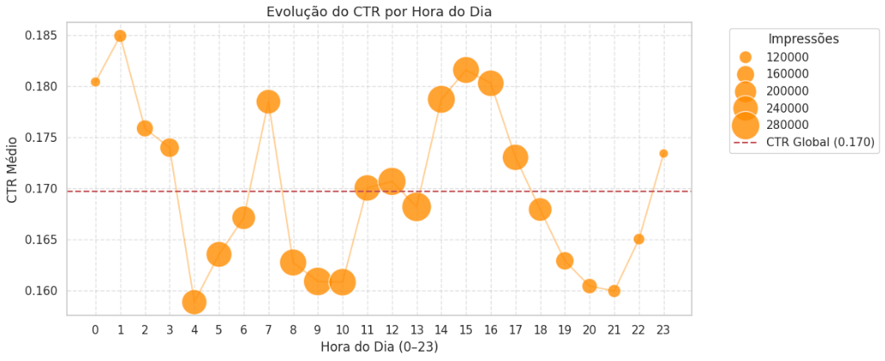

# Milestone 2: Análise Exploratória e Engenharia de Atributos

> **Nota de Revisão:** Este documento pressupõe que o *dataset* já foi identificado e descrito no ficheiro `docs/M1_iniciacao.md`. O dicionário de variáveis original encontra-se nessa secção.

*Data de última atualização: 23/04/2026*


## Nota Técnica: Estratégia de Amostragem

O *dataset* Avazu CTR Prediction contém **40.428.967 registos**, o que inviabiliza o carregamento direto com `pd.read_csv()` (esgota a RAM disponível no Kaggle) e impossibilita o *upload* direto para o GitHub.

Por sugestão da professora, foi adotada uma estratégia de analisar apenas uma **amostra aleatória de 5.000.000 registos** (`random_state=42`), garantindo:

- **Reprodutibilidade total:** a mesma semente produz sempre a mesma amostra, permitindo que qualquer membro da equipa replique os resultados de forma exata.
- **Representatividade estatística:** a amostragem aleatória simples, sem viés de seleção, preserva as distribuições originais das variáveis — em particular o rácio de desequilíbrio da variável alvo.
- **Compatibilidade com o Kaggle:** a amostra ocupa aproximadamente 2 GB em memória, dentro dos limites da plataforma.

O carregamento é feito através da geração de um conjunto de índices aleatórios com `np.random.choice`, usado para filtrar as linhas do CSV original via o argumento `skiprows` do `pd.read_csv()`:

```python
np.random.seed(RANDOM_STATE)
keep_indices = set(np.random.choice(TOTAL_ROWS, size=SAMPLE_SIZE, replace=False))

df = pd.read_csv(
    FILE_PATH,
    skiprows=lambda i: i > 0 and (i - 1) not in keep_indices
)
```

> Todas as células seguintes operam sobre este `df` — **não recarregar o ficheiro**.


## 1. Análise Exploratória de Dados (EDA)

### 1.1. Inspeção Inicial da Amostra Bruta

A primeira etapa consistiu numa auditoria técnica completa ao *dataset* carregado, verificando sistematicamente as seguintes dimensões:

**Dimensões e estrutura:** Foram confirmados **5.000.000 registos × 24 colunas**, validando o sucesso da amostragem. As primeiras 5 linhas foram exibidas para inspeção visual da estrutura e dos valores reais.

**Tipos de dados:** Foi mapeado o `dtype` de cada coluna e comparado com um dicionário de tipos-alvo definido a priori. O output gerou uma tabela com o estado de cada variável (`Correto` / `A corrigir`), confirmando que todas as 24 colunas estavam conformes — com exceção de `id`, que é `uint64` em vez de `float64`, diferença sem impacto prático uma vez que esta coluna é removida no pré-processamento.

**Valores nulos:** A verificação com `df.isnull().sum()` reportou **zero valores nulos** em todas as colunas. Este resultado não significa ausência de dados em falta — o *dataset* Avazu utiliza o valor `-1` como marcador de ausência de informação nas colunas anónimas, investigado na secção 2.1.

**Estatísticas descritivas numéricas:** O `df.describe()` revelou os principais momentos estatísticos (média, desvio padrão, mínimo, percentis, máximo) para as variáveis numéricas, permitindo detetar distribuições enviesadas e a presença de `-1` como valor mínimo em algumas colunas anónimas.

**Estatísticas descritivas categóricas:** Para as colunas de tipo `object` (identificadores de site, app e dispositivo), foi construído um resumo com o número de valores únicos (`nunique`), a categoria mais frequente (`top`) e a sua frequência absoluta (`freq`). Este output revelou a **elevada cardinalidade** de variáveis como `site_id` e `app_id`, antecipando a necessidade de estratégias de *encoding* específicas.

**Registos duplicados:** Foi confirmada a ausência de linhas totalmente duplicadas (`df.duplicated().sum() = 0`). No entanto, foram detetados **1.130.966 registos (22,62%)** com combinação idêntica de `device_ip`, `device_id`, `hour`, `site_id` e `app_id` (duplicados lógicos). Estes foram **mantidos** porque, em contexto de *Real-Time Bidding*, é normal o mesmo utilizador ser exposto ao mesmo anúncio várias vezes — removê-los eliminaria informação real sobre frequência de exposição.


### 1.2. Distribuição da Variável Alvo

A variável alvo `click` é binária e está fortemente desequilibrada. O código produziu um gráfico de barras com as percentagens de cada classe, anotando cada barra com o valor exato, e imprimiu os seguintes resultados:

```
Cliques     (1):   848.594  (16,97%)
Não-cliques (0): 4.151.406  (83,03%)
Rácio desbalanceamento: 1:5
```

Este desequilíbrio tem uma consequência direta: um modelo que previsse sempre "não clique" teria 83% de *accuracy* sem qualquer utilidade preditiva — fenómeno conhecido como *accuracy paradox* (Japkowicz & Stephen, 2002). Por isso, definimos o **AUC-ROC** como métrica principal e o **F1-Score** como métrica secundária, por serem robustas ao desequilíbrio de classes. A *Accuracy* foi excluída da avaliação.


### 1.3. Distribuição de Frequências por Variável Categórica

Para as variáveis `site_category`, `app_category`, `device_type`, `banner_pos` e `device_conn_type`, foram gerados gráficos de barras com as **10 categorias mais frequentes**, com a percentagem relativa ao total anotada em cada barra.

O código converteu cada coluna para `str` de forma a incluir o marcador `-1` como categoria explícita, renomeada para `'Dados Omissos'`. Os principais *outputs* foram:

- **`site_category` e `app_category`:** Distribuição muito assimétrica — uma minoria de categorias agrega a grande maioria das impressões (*long-tail*). Categorias desconhecidas têm representação residual.
- **`device_type`:** O valor `0` (telemóveis) corresponde à grande maioria das impressões, com tablets e outros dispositivos com representação muito inferior.
- **`banner_pos`:** A posição `1` é de longe a mais frequente; posições superiores a `5` têm frequência residual.
- **`device_conn_type`:** Destaque para a presença de registos com valor `-1` (`Dados Omissos`), confirmando ausência de informação de conectividade numa fração da amostra — fator a considerar na fase de limpeza.


### 1.4. Correlações Relevantes e Três Conclusões Visuais

Foi gerada uma **Matriz de Correlação de Pearson** entre as variáveis numéricas e a variável alvo. O código produziu duas visualizações complementares: um *heatmap* completo (todas as combinações par-a-par) e um *heatmap* triangular (triângulo inferior, eliminando a redundância simétrica). Adicionalmente, foram impressas as correlações individuais de cada variável com `click`, ordenadas por valor absoluto decrescente, e verificada a existência de pares com multicolinearidade acima do *threshold* de **0,95**.


**Conclusão 1 — O CTR varia significativamente com a hora do dia.** A análise bivariada mostra que as primeiras horas da madrugada (0h–3h) têm CTR acima da média global de 16,97%, o que contraria a intuição inicial. Isto motivou a criação da variável `hora_do_dia`.

**Conclusão 2 — A variável `C16` tem a correlação mais forte com `click` (r = +0,1303).** As variáveis anónimas `C14`, `C15` e `C16` são as mais correlacionadas com a variável alvo — valores positivos para `C16` e negativos para `C14` e `C17`. Isto sugere que representam características do anúncio com impacto direto na decisão de clique. Foi também detetado um par com multicolinearidade elevada: **`C14` e `C17` têm correlação de Pearson r = 0,9769**, acima do limiar de 0,95 definido para remoção.

**Conclusão 3 — A posição do *banner* e o tipo de dispositivo influenciam o CTR.** A posição 0 concentra a maioria das impressões mas não tem o CTR mais alto. Dispositivos diferentes mostram padrões de clique distintos, motivando a criação de `banner_area` como medida de impacto visual do anúncio.


### 1.5. Análise Bivariada do CTR

Esta secção produziu visualizações que relacionam diretamente as variáveis contextuais com a **Taxa de Clique (CTR)** observada. O código calculou o CTR médio por segmento (`clicks / impressions`) e comparou cada segmento face ao **CTR global** (linha horizontal tracejada a vermelho).

#### CTR por Hora do Dia

A variável `hora_do_dia` foi extraída temporariamente via `df['hour'] % 100`. O gráfico de dispersão com tamanho proporcional ao volume de impressões revelou:

- **Picos nas primeiras horas da madrugada (0h–6h):** O CTR neste período é consistentemente acima da média global, podendo atingir mais do dobro do valor típico durante o dia.
- **Mínimos ao início da tarde (12h–15h):** O período de menor propensão ao clique coincide com horários laborais.
- **Representatividade variável:** Os pontos de maior dimensão (mais impressões) concentram-se nos horários de maior atividade, tornando os CTR extremos nas madrugadas estatisticamente menos robustos.



#### CTR por Posição do Banner

- **Posição 0** apresentou o CTR mais elevado, acima da média global, mas não concentra a maioria das impressões.
- **Posições 1 e 2** ficaram próximas ou ligeiramente abaixo da média, com maior volume de exposição.
- **Posições superiores a 5** apresentaram CTR reduzido, com volume de impressões muito menor e estimativas menos fiáveis.


#### CTR por Tipo de Dispositivo

- **`device_type = 0` (telemóveis):** CTR sistematicamente mais elevado do que a média global.
- **`device_type = 1` (tablets):** CTR abaixo da média.
- Os restantes tipos de dispositivo têm volume residual, tornando as estimativas menos representativas.


#### CTR por Tipo de Ligação

- **`device_conn_type = 2` (Wi-Fi):** CTR superior à média global.
- Ligações móveis (3G/4G) apresentaram CTR mais próximo da média ou ligeiramente abaixo.


### 1.6. Quantificação de Outliers pelo Método IQR

Foi implementada a função `calcular_outliers_iqr()`, que aplica o método do **Intervalo Interquartil (IQR)** a todas as variáveis numéricas. Escolhemos este método em vez de critérios baseados no desvio padrão porque **não assume distribuição Normal** — mais adequado para as variáveis discretas e assimétricas do Avazu.

Para cada variável, o código calcula Q1, Q3, o IQR, os limites [Q1 − 1,5×IQR, Q3 + 1,5×IQR] e conta os registos que os violam. As colunas com maior percentagem de *outliers* foram **C19 (18,02%)**, **C21 (14,27%)**, **`device_conn_type` (13,66%)** e **C17 (8,47%)**.

Optámos por **não remover** nenhum destes valores porque representam comportamentos reais de utilizadores — não são erros de medição. Além disso, os algoritmos usados na modelação (*Random Forest* e *XGBoost*) são naturalmente robustos a *outliers* por serem baseados em árvores de decisão.


## 2. Qualidade dos Dados e Limpeza

### 2.1. Tratamento de Dados em Falta (*Missing Data*)

O *dataset* Avazu não usa `NaN` para assinalar dados omissos — utiliza o valor **`-1`** como marcador de ausência de informação nas colunas anónimas `C14`–`C21`, prática comum em sistemas de registo de publicidade (He et al., 2014).

O código percorreu todas essas colunas e imprimiu, para cada uma, a frequência absoluta e a percentagem de valores `-1`. Foi definido um **limiar de 1%**: colunas abaixo deste limiar foram consideradas limpas; acima disso, imputação pela moda.

```
DADOS EM FALTA (Marcador -1):
Atributo       Frequência    Percentagem
------------------------------------------
C14                    0          0,00%
C15                    0          0,00%
C16                    0          0,00%
C17                    0          0,00%
C18                    0          0,00%
C19                    0          0,00%
C20            2.344.248         46,88%
C21                    0          0,00%
```

A coluna mais crítica foi **`C20`**, com **2.344.248 valores `-1` (46,88% da amostra)**. Optámos por **imputação pela moda** (valor mais frequente: `100084`) em vez de média ou mediana porque `C20` é uma variável categórica codificada numericamente — calcular a média de identificadores de categoria não tem sentido lógico, e a moda preserva a natureza discreta da variável.

O gráfico de barras lado a lado (vermelho = antes, verde = depois) confirmou visualmente que a distribuição se estabilizou após a imputação, sem introduzir distorções aparentes nas categorias existentes.


### 2.2. Outliers e Inconsistências

O método IQR (detalhado na secção 1.6) foi aplicado formalmente nesta fase para decidir sobre o tratamento. As variáveis `C14`, `C17`, `C19`, `C20` e `C21` apresentaram *outliers* segundo o critério IQR, mas foram **mantidos** no *dataset*.

Não foram encontrados valores impossíveis em variáveis com domínio conhecido. A conformidade de todos os 24 atributos com o perfil técnico esperado foi verificada e auditada.


## 3. Engenharia de Atributos (*Feature Engineering*)

### 3.1. Transformações Realizadas

O pré-processamento foi executado sobre uma cópia do *dataframe* (`df_proc = df.copy()`), preservando o original para eventuais consultas.

#### Imputação de *Missing* Mascarados

Como primeira etapa, o marcador `-1` em `C20` foi substituído pela moda calculada sobre os valores válidos:

```python
moda_c20 = int(df_proc['C20'][df_proc['C20'] != -1].mode()[0])
df_proc['C20'] = df_proc['C20'].replace(-1, pd.NA).fillna(moda_c20).astype(int)
```

#### *Encoding* das Variáveis Categóricas — *Frequency Encoding*

As colunas categóricas de alta cardinalidade (`site_id`, `site_domain`, `site_category`, `app_id`, `app_domain`, `app_category`, `device_model`) foram transformadas usando ***Frequency Encoding***: cada categoria é substituída pela sua frequência relativa no conjunto de treino.

Optámos por *Frequency Encoding* em vez de *Label Encoding* porque o *Label Encoding* atribui inteiros sequenciais às categorias, criando uma falsa relação ordinal — o modelo assumiria que `site_id=500` está "entre" 499 e 501, o que não tem qualquer significado. O *Frequency Encoding* preserva informação real (categorias mais frequentes têm valores mais altos) sem introduzir ordinalidade artificial.

> **Prevenção de *data leakage*:** o *encoding* foi calculado **exclusivamente sobre o conjunto de treino** e depois aplicado ao conjunto de teste. Categorias que só aparecem no teste recebem frequência 0. Se calculássemos as frequências sobre todo o *dataset* antes de dividir, o conjunto de teste estaria a contaminar o treino.

#### Escalonamento — *StandardScaler*

O *StandardScaler* foi aplicado às variáveis numéricas no contexto da Regressão Logística (*baseline*), transformando cada variável para média 0 e desvio padrão 1. Os modelos baseados em árvores de decisão (*Random Forest*, *XGBoost*) não requerem escalonamento. Tal como o *encoding*, o *scaler* foi ajustado apenas no treino e aplicado ao teste.

#### Remoção de Variáveis Não Preditivas

As colunas `id`, `device_id` e `device_ip` foram removidas por serem identificadores individuais sem poder preditivo — têm cardinalidade próxima do número total de registos e não generalizam para dados novos. A coluna `hour` foi removida após a extração de `hora_do_dia`.

#### Remoção por Multicolinearidade

Após o *encoding*, foi confirmada a correlação r = 0,9769 entre `C14` e `C17`, acima do limiar de 0,95. Manter variáveis tão correlacionadas não acrescenta informação ao modelo e pode introduzir instabilidade numérica. Foram removidas as colunas `site_domain`, `app_category`, `C17` e `visibilidade_anuncio` de ambos os conjuntos (treino e teste). O *dataset* final ficou com **18 variáveis**.


### 3.2. Criação de Novos Atributos

Foram criadas três novas variáveis a partir das existentes, com verificação prévia da correlação com `click` antes de as incluir no *pipeline*:

#### `hora_do_dia`

```python
df_proc['hora_do_dia'] = df_proc['hour'] % 100
```

Extraída de `hour` (formato `YYMMDDhh`) via operação módulo 100, retendo apenas o componente horário (0–23) e descartando a informação de data. A análise bivariada confirmou que o CTR varia de forma consistente ao longo do dia (picos nas madrugadas, mínimos ao início da tarde), tornando esta variável relevante para o modelo.

#### `banner_area`

```python
df_proc['banner_area'] = df_proc['C15'] * df_proc['C16']
```

Calculada como C15 × C16. Os valores únicos destas colunas (120, 216, 300, 320, 480, 728, 768, 1024) correspondem a dimensões *standard* de *banners* publicitários, confirmando que representam largura e altura em píxeis. A área é uma medida de impacto visual mais direta do que as dimensões isoladas e foi confirmada como uma das variáveis mais importantes pelo modelo final.

#### `visibilidade_anuncio`

```python
df_proc['visibilidade_anuncio'] = (df_proc['banner_pos'] + 1) / np.log1p(df_proc['banner_area'])
```

Combina a posição do anúncio na página com a sua dimensão. Usámos `banner_pos + 1` para evitar que a posição 0 (topo da página) anule a variável, e `log1p` para suavizar o efeito de áreas muito grandes. Esta variável foi posteriormente **removida por multicolinearidade** (r > 0,95), mas a sua criação e avaliação integram o processo de *feature engineering* documentado.


## 4. Dicionário de Dados Final (Pós-Processamento)

O *dataset* processado tem **5.000.000 registos × 18 colunas** e foi guardado em `data/processed/`.

| Atributo | Tipo | Descrição | Transformação |
| :--- | :--- | :--- | :--- |
| `click` | Inteiro (0/1) | **Variável alvo** — 1: clique; 0: não clique | Nenhuma |
| `C1` | Inteiro | Variável anónima de contexto do anúncio | Nenhuma |
| `banner_pos` | Inteiro | Posição do anúncio na página | Nenhuma |
| `site_id` | *Float* | Identificador do *site* | *Frequency Encoding* |
| `site_category` | *Float* | Categoria temática do *site* | *Frequency Encoding* |
| `app_id` | *Float* | Identificador da aplicação | *Frequency Encoding* |
| `app_domain` | *Float* | Domínio da aplicação | *Frequency Encoding* |
| `device_model` | *Float* | Modelo do dispositivo | *Frequency Encoding* |
| `device_type` | Inteiro | Tipo de dispositivo (0 = telemóvel, 1 = tablet) | Nenhuma |
| `device_conn_type` | Inteiro | Tipo de ligação à rede | Nenhuma |
| `C14` | Inteiro | Variável anónima de configuração do anúncio | Nenhuma |
| `C15` | Inteiro | Variável anónima — largura do *banner* (px) | Nenhuma |
| `C16` | Inteiro | Variável anónima — altura do *banner* (px) | Nenhuma |
| `C18` | Inteiro | Variável anónima de configuração do anúncio | Nenhuma |
| `C19` | Inteiro | Variável anónima de configuração do anúncio | Nenhuma |
| `C20` | Inteiro | Variável anónima de configuração do anúncio | Imputação pela moda (−1 → 100084) |
| `C21` | Inteiro | Variável anónima de configuração do anúncio | Nenhuma |
| `hora_do_dia` | Inteiro | **Nova** — Hora extraída de `hour` (0–23) | `hour % 100` |
| `banner_area` | Inteiro | **Nova** — Área estimada do *banner* (px²) | C15 × C16 |
| `id` | — | Identificador único | **Removido** — sem poder preditivo |
| `device_id` | — | Identificador do dispositivo | **Removido** — sem poder preditivo |
| `device_ip` | — | Endereço IP do utilizador | **Removido** — sem poder preditivo |
| `hour` | — | Marcação temporal original | **Removido** — substituído por `hora_do_dia` |
| `site_domain` | — | Domínio do *site* | **Removido** — multicolinearidade (r > 0,95) |
| `app_category` | — | Categoria da aplicação | **Removido** — multicolinearidade (r > 0,95) |
| `C17` | — | Variável anónima | **Removido** — multicolinearidade com C14 (r = 0,9769) |
| `visibilidade_anuncio` | — | Índice combinado de visibilidade | **Removido** — multicolinearidade (r > 0,95) |


## 5. Conclusões da Fase de Exploração

Esta fase permitiu passar de um *dataset* bruto com 24 colunas para um conjunto processado com 18 variáveis, pronto para a modelação.

1. **O desequilíbrio (1:5) é o facto mais condicionante de todo o projeto.** Define a métrica de avaliação (AUC-ROC), obriga ao uso de pesos compensatórios nos algoritmos e exige estratificação em todas as divisões de dados. A *Accuracy* foi excluída da avaliação por ser enganadora neste contexto.

2. **Os dados não têm nulos explícitos, mas `C20` mascarava quase metade dos registos com `-1`.** Algo que não era visível numa inspeção rápida e que poderia ter enviesado o modelo se não tivesse sido tratado com imputação pela moda.

3. **O contexto visual do anúncio é mais preditivo do que o perfil do dispositivo.** As variáveis `C16` (r = +0,1303) e `banner_area` revelaram correlações mais fortes com o clique do que `device_type` ou `device_conn_type`, o que foi posteriormente confirmado pela análise de importância de variáveis do modelo final.

4. **A hora do dia é uma variável preditiva relevante.** O padrão temporal do CTR é consistente e explorável pelo modelo — os picos nas primeiras horas da madrugada e os mínimos ao início da tarde justificaram a criação de `hora_do_dia`.

5. **A multicolinearidade entre `C14` e `C17` (r = 0,9769) exigiu remoção.** Manter variáveis tão correlacionadas não acrescenta informação e pode introduzir instabilidade numérica. O *dataset* final ficou com 18 variáveis após limpeza.

O *dataset* processado está guardado em `data/processed/` e corre do início ao fim sem erros no *notebook* `3_0_interpretacao.ipynb`.


## Referências

He, X., Pan, J., Jin, O., Xu, T., Liu, B., Xu, T., Shi, Y., Atallah, A., Herbrich, R., Bowers, S., & Candela, J. Q. (2014). Practical lessons from predicting clicks on ads at Facebook. *Proceedings of the 8th International Workshop on Data Mining for Online Advertising*, 1–9. https://doi.org/10.1145/2648584.2648589

Japkowicz, N., & Stephen, S. (2002). The class imbalance problem: A systematic study. *Intelligent Data Analysis*, *6*(5), 429–449. https://doi.org/10.3233/IDA-2002-6504

Kaggle. (s.d.). *Avazu CTR prediction* [*Dataset*]. https://www.kaggle.com/datasets/madhu41289/avazu-ctr-prediction-exp

Pedregosa, F., Varoquaux, G., Gramfort, A., Michel, V., Thirion, B., Grisel, O., Blondel, M., Prettenhofer, P., Weiss, R., Dubourg, V., Vanderplas, J., Passos, A., Cournapeau, D., Brucher, M., Perrot, M., & Duchesneau, É. (2011). Scikit-learn: Machine learning in Python. *Journal of Machine Learning Research*, *12*, 2825–2830.
