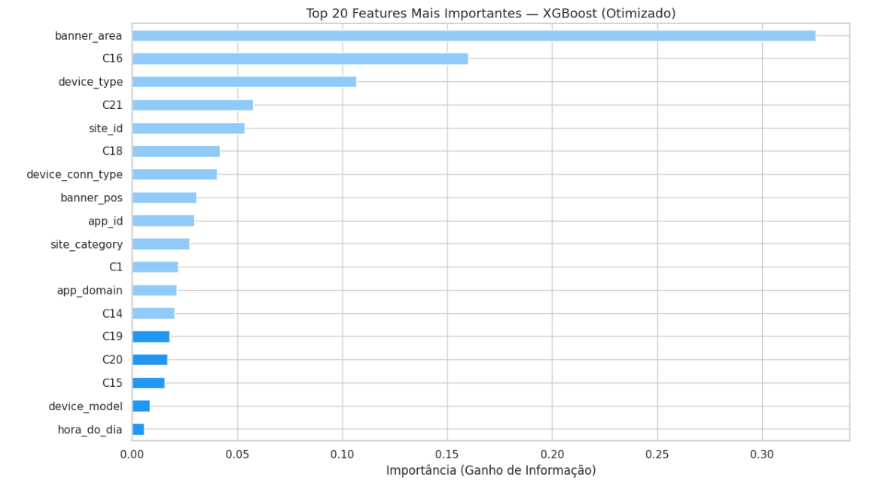
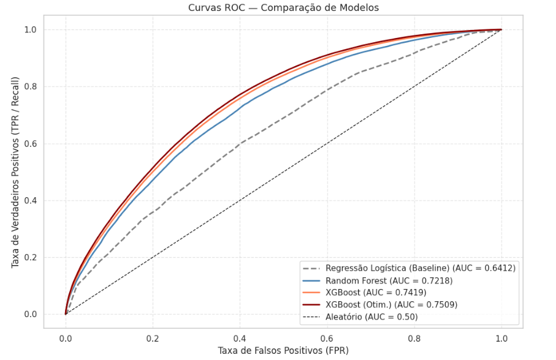

# *Milestone* 3: Modelação e
Avaliação

> Este documento pressupõe que a preparação dos dados está descrita em `docs/M2_exploracao.md`. Os resultados aqui apresentados são consistentes com o *notebook* `notebooks/3_0_interpretacao.ipynb`, que corre do início ao fim sem erros.

*Data de última atualização: 23/04/2026*


## Nota Técnica: Divisão dos Dados e Prevenção de *Data Leakage*

O *dataset* processado foi dividido em **80% para treino (4.000.000 registos)** e **20% para teste (1.000.000 registos)**, com `stratify=y` e `random_state=42`. A estratificação garante que a proporção de cliques (≈17%) se mantém igual em ambos os conjuntos, o que é essencial dado o desequilíbrio de classes.

O output confirmou a correta estratificação:

```
Treino : 4.000.000 registos (80%)
Teste  : 1.000.000 registos (20%)

Proporção de cliques no treino : 0.1697
Proporção de cliques no teste  : 0.1697

Proporções consistentes — divisão estratificada correcta.
Isolamento garantido: X_test nunca será visto durante o treino nem o tuning.
```

O conjunto de teste foi isolado desde o início e nunca foi visto durante o treino ou a otimização — qualquer resultado obtido no teste é, portanto, uma estimativa honesta do desempenho real. O *StandardScaler* foi ajustado exclusivamente no conjunto de treino (`fit_transform`) e depois aplicado ao teste (`transform`). O *Frequency Encoding* também foi calculado apenas no treino. Estas precauções evitam *data leakage* — se o teste influenciasse o pré-processamento, estaríamos a "vazar" informação do futuro para o passado.

> Todas as avaliações seguintes utilizam este isolamento — **não reajustar o *scaler* nem recalcular o *encoding* no teste**.


## 1. Estratégia de Modelação

### 1.1. Métricas de Avaliação

Foi definida uma função `avaliar_completo()` reutilizável para todas as experiências, que calcula AUC-ROC, F1-Score, Precisão e *Recall* de forma consistente, e inclui diagnóstico automático de *overfitting*/*underfitting* baseado no delta entre treino e teste (Δ > 0.05 sinaliza *overfitting*; AUC teste < 0.60 sinaliza *underfitting*).

Escolhemos o **AUC-ROC** como métrica principal por três razões. Primeira: é a métrica oficial da competição Avazu (He et al., 2014), o que nos permite comparar os resultados com a literatura. Segunda: é robusta ao desequilíbrio de classes (83% não-cliques / 17% cliques) — ao contrário da *Accuracy*, que seria enganosa. Terceira: em contexto de *Real-Time Bidding*, o modelo é usado para **ordenar** impressões por probabilidade de clique, não para tomar uma decisão binária com um limiar fixo — e o AUC-ROC mede exatamente essa capacidade de ordenação.

O **F1-Score** foi definido como métrica secundária porque equilibra Precisão e *Recall* — relevante num contexto onde tanto os Falsos Positivos (impressões desperdiçadas) como os Falsos Negativos (receita perdida) têm custo real para o anunciante.

A *Accuracy* foi excluída porque um modelo que previsse sempre "não clique" teria 83% de acerto sem qualquer utilidade preditiva — o chamado *accuracy paradox* (Japkowicz & Stephen, 2002).

### 1.2. Abordagem Iterativa

Seguimos uma abordagem por patamares de complexidade crescente: (1) *baseline* linear simples, (2) modelos de *ensemble* com parâmetros base, (3) otimização de hiperparâmetros do melhor candidato. Esta estrutura garante que cada aumento de complexidade é justificado por um ganho mensurável em AUC-ROC.


## 2. Experiências Realizadas

### 2.1. Modelo *Baseline* — Regressão Logística

Usámos a Regressão Logística como *baseline* por ser o modelo de classificação linear mais simples (Cox, 1958). Serve como ponto de referência: se um modelo complexo não superar significativamente a Regressão Logística, o custo computacional adicional não se justifica.

O `StandardScaler` foi aplicado antes do treino — sem escalonamento, variáveis com escalas muito diferentes dominam o gradiente e o modelo não converge adequadamente. O parâmetro `class_weight='balanced'` compensa o desequilíbrio de classes ajustando automaticamente os pesos inversamente proporcionais às frequências de cada classe. O `max_iter=1000` garante convergência com os dados em alta dimensão.

**Resultados do *baseline*:**

| Métrica | Treino | Teste |
| :--- | :---: | :---: |
| AUC-ROC | 0.6411 | 0.6412 |
| F1-Score | 0.3362 | 0.3363 |
| Precisão | — | 0.2325 |
| *Recall* | — | 0.6073 |

O diagnóstico automático reportou **generalização adequada** (Δ AUC = 0.0001), confirmando ausência de *overfitting*. O *baseline* estabelece o patamar mínimo: qualquer modelo candidato tem de superar AUC-ROC = 0.6412 para justificar a sua complexidade adicional. A curva de aprendizagem mostra que o modelo converge rapidamente e não beneficia significativamente de mais dados — comportamento esperado num modelo linear aplicado a um problema não-linear.


### 2.2. Modelos Candidatos

Testámos dois algoritmos de *ensemble learning* de maior complexidade:

***Random Forest*** — conjunto de árvores de decisão treinadas com *bagging*. Cada árvore vê uma amostra diferente dos dados e um subconjunto aleatório de variáveis em cada divisão, o que reduz a correlação entre árvores e baixa a variância do modelo final. Usámos `n_estimators=100`, `max_depth=10` e `class_weight='balanced'`. Ao contrário da Regressão Logística, não requer escalonamento — as árvores de decisão são invariantes à escala.

**XGBoost** — *gradient boosting* que aprende iterativamente os erros dos modelos anteriores. É o estado da arte em competições de CTR com dados tabulares (Chen & Guestrin, 2016). Usámos `scale_pos_weight` calculado automaticamente como o rácio entre não-cliques e cliques no conjunto de treino (≈ 4), `n_estimators=200`, `max_depth=6` e `learning_rate=0.1`.

| Algoritmo | AUC-ROC (Treino) | AUC-ROC (Teste) | F1 (Teste) | Δ AUC | Notas |
| :--- | :---: | :---: | :---: | :---: | :--- |
| *Baseline* (Reg. Logística) | 0.6411 | 0.6412 | 0.3363 | 0.0001 | Patamar de referência |
| *Random Forest* | 0.7231 | 0.7218 | 0.3938 | 0.0013 | Boa generalização |
| **XGBoost** | **0.7436** | **0.7419** | **0.4157** | **0.0017** | **Melhor AUC-ROC** |

Ambos os modelos superam claramente o *baseline* (+0.08 para o *Random Forest* e +0.10 para o XGBoost em AUC-ROC). O XGBoost apresentou o melhor desempenho no conjunto de teste e foi selecionado para a fase de otimização. As curvas de aprendizagem de ambos os modelos mostram boa generalização — as curvas de treino e validação convergem sem *gap* significativo, confirmando ausência de *overfitting* severo. O *Random Forest* tem comportamento ligeiramente mais estável à medida que o número de exemplos aumenta, mas o XGBoost parte de um nível mais alto.


---

## 3. Otimização (*Tuning*)

Usámos *RandomizedSearchCV* com 20 iterações e `StratifiedKFold` com K=5 *folds*, aplicado exclusivamente ao conjunto de treino — o conjunto de teste permaneceu completamente isolado durante todo este processo.

Optámos por *RandomizedSearchCV* em vez de *GridSearchCV* porque o espaço de hiperparâmetros é vasto (distribuições contínuas para `learning_rate` e `subsample`) e uma pesquisa exaustiva seria computacionalmente proibitiva com 4 milhões de registos. Com 20 iterações, o algoritmo explorou combinações suficientes para encontrar uma solução próxima do ótimo em tempo razoável.

**Melhores hiperparâmetros encontrados:**

| Hiperparâmetro | Valor | Significado |
| :--- | :---: | :--- |
| `colsample_bytree` | 0.787 | Fracção de colunas usadas em cada árvore |
| `learning_rate` | 0.182 | Tamanho do passo de gradiente por iteração |
| `max_depth` | 8 | Profundidade máxima de cada árvore |
| `min_child_weight` | 9 | Peso mínimo necessário para criar um nó folha |
| `n_estimators` | 266 | Número total de árvores no *ensemble* |
| `subsample` | 0.605 | Fracção de registos usados em cada árvore |

**Melhor AUC-ROC médio nos 5 *folds* (treino):** 0.7505

**Comparação base vs. otimizado:**

| Modelo | AUC-ROC (Treino) | AUC-ROC (Teste) | F1 (Teste) | Melhoria |
| :--- | :---: | :---: | :---: | :---: |
| XGBoost (base) | 0.7436 | 0.7419 | 0.4157 | — |
| **XGBoost (otimizado)** | **0.7612** | **0.7509** | **0.4223** | **+0.0090** |

A otimização melhorou o AUC-ROC em 0.009 pontos no conjunto de teste, elevando o desempenho para **0.7509** e ultrapassando o objetivo SMART definido (AUC-ROC > 0.75 ✓). A melhoria acumulada face ao *baseline* inicial é de **+0.1097**.

---

## 4. Avaliação do Modelo Final

### 4.1. *Cross-Validation* e Estabilidade

Após a otimização, aplicámos *5-Fold Cross-Validation* ao modelo otimizado dentro do conjunto de treino para confirmar que o resultado não é fruto de uma divisão afortunada dos dados.

| *Fold* | AUC-ROC |
| :---: | :---: |
| 1 | 0.7497 |
| 2 | 0.7509 |
| 3 | 0.7502 |
| 4 | 0.7502 |
| 5 | 0.7513 |
| **Média** | **0.7505** |
| **Desvio padrão** | **0.0006** |

O desvio padrão de 0.0006 é muito baixo — o modelo é estável e os resultados são repetíveis independentemente de como os dados são divididos. O IC a 95% é [0.7493, 0.7516], confirmando que o objetivo SMART está atingido com confiança estatística.


### 4.2. Matriz de Confusão e Análise de Erros

No conjunto de teste (1.000.000 registos, *threshold* = 0.5), o código calculou e imprimiu os quatro quadrantes da matriz e as métricas de negócio associadas:

```
MATRIZ DE CONFUSÃO — MODELO FINAL
=========================================================
  Verdadeiros Negativos (VN):  577.197  (57,7%)
  Falsos Positivos      (FP):  253.084  (25,3%)
  Falsos Negativos      (FN):   56.547   (5,6%)
  Verdadeiros Positivos (VP):  113.172  (11,3%)

  Precisão : 0.3092  — dos previstos como clique, quantos clicaram de facto
  Recall   : 0.6671  — dos cliques reais, quantos foram detetados
  Taxa FP  : 0.3048  — anúncios exibidos a utilizadores desinteressados
  Taxa FN  : 0.3329  — oportunidades de receita perdidas
```

| | Previsto: Não-clique | Previsto: Clique |
| :--- | :---: | :---: |
| **Real: Não-clique** | 577.197 (VN) | 253.084 (FP) |
| **Real: Clique** | 56.547 (FN) | 113.172 (VP) |

- **Falsos Positivos (FP): 253.084 (25,3%)** — o modelo previu clique quando não houve. Em contexto de *RTB*, correspondem a impressões pagas sem retorno — custo desperdiçado para o anunciante.
- **Falsos Negativos (FN): 56.547 (5,6%)** — o modelo não previu clique quando havia. Representam oportunidades de receita publicitária perdidas — uma impressão ignorada com probabilidade real de clique é um negócio perdido.

O *Recall* de 0.6671 significa que o modelo consegue identificar **67% dos cliques reais**, razoável dado o nível de desequilíbrio. A análise de diagnóstico complementar revelou que os Falsos Negativos se concentram mais em impressões da hora 17:00 e em contextos com `device_conn_type` elevado (ligações de dados móveis), sugerindo que o comportamento de clique nestes contextos é mais difícil de prever com as variáveis disponíveis. Uma possível melhoria futura seria ajustar o *threshold* de decisão abaixo de 0.5 para favorecer o *Recall* em detrimento da Precisão — o que faz sentido num contexto onde perder cliques reais é mais caro do que fazer lances desnecessários.


### 4.3. Importância dos Atributos (*Feature Importance*)

O código extraiu as importâncias nativas do XGBoost (`feature_importances_`), medidas pelo ganho de informação, e ordenou-as de forma decrescente. As 5 variáveis mais importantes foram:

```
Top 5 Variáveis mais Importantes:
  1. banner_area          importância = 0.3260
  2. C16                  importância = 0.1600
  3. device_type          importância = 0.1070
  4. C21                  importância = 0.0570
  5. site_id              importância = 0.0540
```

| # | Variável | Importância | Interpretação |
| :---: | :--- | :---: | :--- |
| 1 | `banner_area` | 0.326 | **Nova variável criada** — área do *banner* (C15 × C16) |
| 2 | `C16` | 0.160 | Dimensão do *banner* (altura em píxeis) |
| 3 | `device_type` | 0.107 | Tipo de dispositivo (móvel vs. PC) |
| 4 | `C21` | 0.057 | Variável anónima do anúncio |
| 5 | `site_id` | 0.054 | Identificador do *site* (após *Frequency Encoding*) |

O resultado mais relevante é que `banner_area`, a variável criada neste projeto, é a mais importante do modelo — o que valida diretamente a decisão de criar esta *feature* na fase de engenharia de atributos. As características do anúncio (dimensão, posição) e do dispositivo dominam sobre as características do utilizador ou do contexto de navegação. As top-5 variáveis concentram **70% da importância total** do modelo, o que sugere que um modelo mais simples com estas 5 variáveis poderia ter desempenho competitivo com muito menos custo computacional — uma pista para trabalho futuro.




A curva ROC compara visualmente todos os modelos. Quanto mais a curva se aproxima do canto superior esquerdo, maior a capacidade discriminativa. A progressão clara de *Baseline* → *Random Forest* → XGBoost → XGBoost Otimizado confirma que cada iteração trouxe ganhos reais e consistentes.

---

## 5. Conclusões da Fase de Modelação

Esta fase permitiu evoluir de um *baseline* linear simples para um modelo de *gradient boosting* otimizado, com uma melhoria acumulada de +0.1097 em AUC-ROC.

1. **O XGBoost otimizado atingiu AUC-ROC = 0.7509 ✓**, superando o objetivo SMART definido no *Milestone* 1. A estabilidade confirmada pela *cross-validation* (σ = 0.0006) garante que este resultado é robusto e não fruto de uma divisão afortunada dos dados.

2. **A variável `banner_area`, criada na fase de engenharia de atributos, é a mais importante do modelo (32.6% do ganho de informação total).** Este resultado valida retroativamente a decisão de criar esta *feature* e confirma que o formato visual do anúncio é o fator mais determinante para prever o comportamento de clique.

3. **A Regressão Logística confirmou o seu papel de referência.** Ficou 0.11 pontos abaixo do melhor modelo em AUC-ROC — uma diferença que justifica plenamente o custo computacional adicional do XGBoost.

4. **Os Falsos Negativos são o erro mais prejudicial para o negócio.** Embora menos numerosos do que os Falsos Positivos (56.547 vs. 253.084), cada FN representa uma impressão com probabilidade real de clique que o modelo ignorou — receita perdida. Ajustar o *threshold* de decisão abaixo de 0.5 poderia melhorar o *Recall* à custa de mais FP, o que pode ser preferível dependendo da estratégia do anunciante.

5. **A concentração de importância nas top-5 variáveis (70% do total) abre caminho para simplificação futura.** Um modelo mais leve, treinado apenas com `banner_area`, `C16`, `device_type`, `C21` e `site_id`, poderia ser suficientemente competitivo para cenários de produção com restrições de latência em *Real-Time Bidding*.

O *dataset* processado está guardado em `data/processed/` e o *notebook* `3_0_interpretacao.ipynb` corre do início ao fim sem erros.

---

## Referências

Chen, T., & Guestrin, C. (2016). XGBoost: A scalable tree boosting system. *Proceedings of the 22nd ACM SIGKDD International Conference on Knowledge Discovery and Data Mining*, 785–794. https://doi.org/10.1145/2939672.2939785

Cox, D. R. (1958). The regression analysis of binary sequences. *Journal of the Royal Statistical Society: Series B*, *20*(2), 215–232.

He, X., Pan, J., Jin, O., Xu, T., Liu, B., Xu, T., Shi, Y., Atallah, A., Herbrich, R., Bowers, S., & Candela, J. Q. (2014). Practical lessons from predicting clicks on ads at Facebook. *Proceedings of the 8th International Workshop on Data Mining for Online Advertising*, 1–9. https://doi.org/10.1145/2648584.2648589

Japkowicz, N., & Stephen, S. (2002). The class imbalance problem: A systematic study. *Intelligent Data Analysis*, *6*(5), 429–449. https://doi.org/10.3233/IDA-2002-6504

Pedregosa, F., Varoquaux, G., Gramfort, A., Michel, V., Thirion, B., Grisel, O., Blondel, M., Prettenhofer, P., Weiss, R., Dubourg, V., Vanderplas, J., Passos, A., Cournapeau, D., Brucher, M., Perrot, M., & Duchesneau, É. (2011). Scikit-learn: Machine learning in Python. *Journal of Machine Learning Research*, *12*, 2825–2830.
