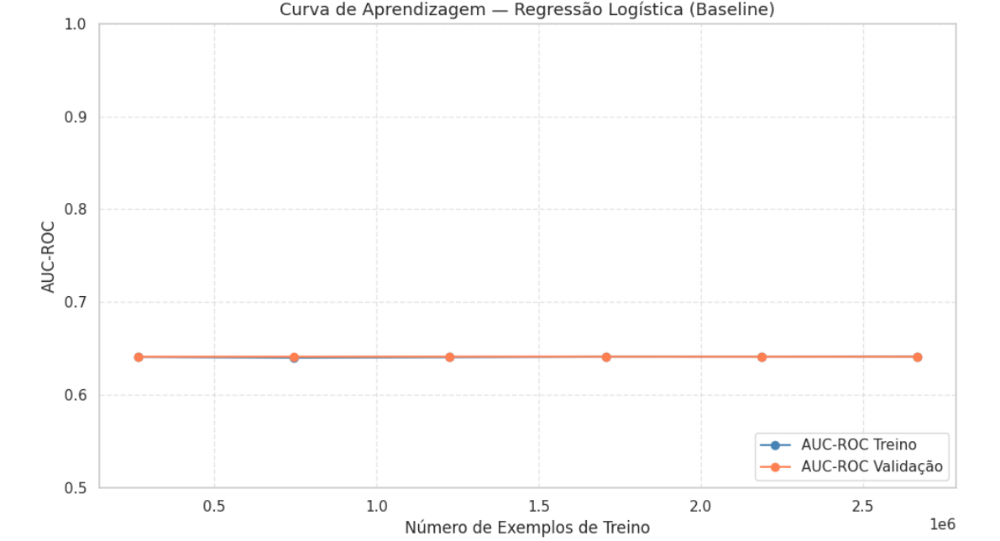
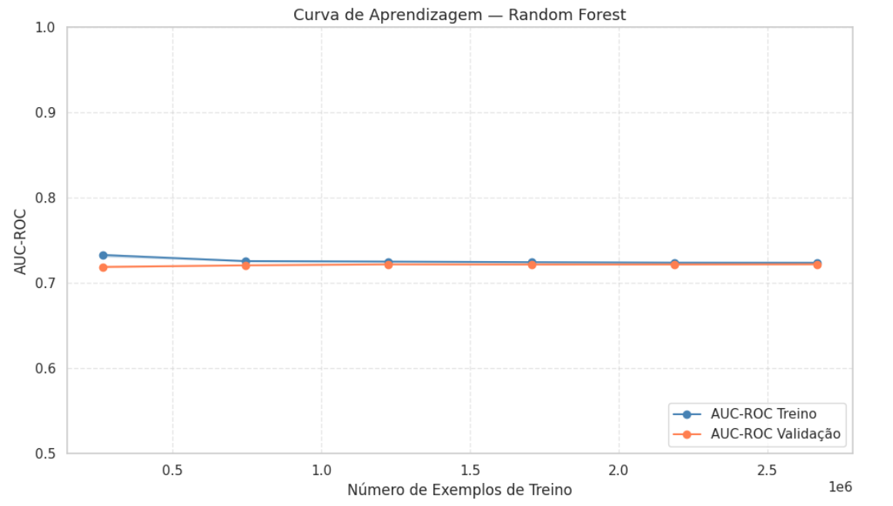
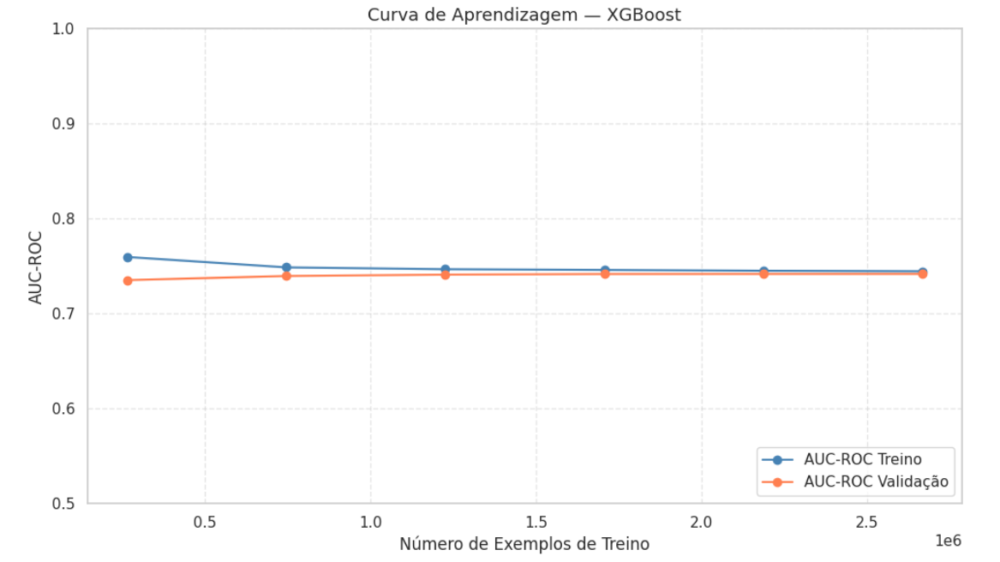
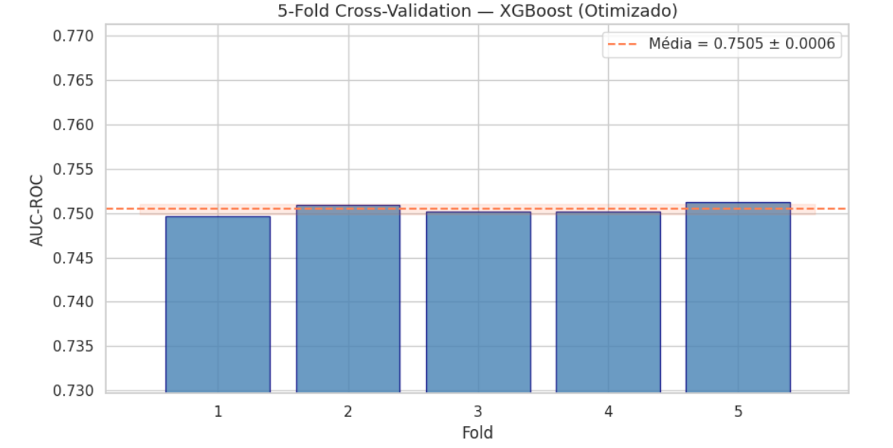
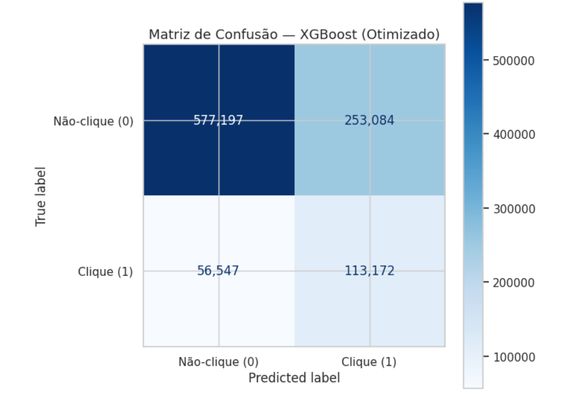

# *Milestone* 3: Modelação e Avaliação

> Este documento pressupõe que a preparação dos dados está descrita em `docs/M2_exploracao.md`. Os resultados aqui apresentados são consistentes com o *notebook* `notebooks/2.0_modelacao_treino.ipynb`, que corre do início ao fim sem erros.

*Data de última atualização: Abril 2026*

---

## 1. Estratégia de Modelação

### Divisão dos dados

Dividimos os dados em 80% para treino (4.000.000 registos) e 20% para teste (1.000.000 registos), com `stratify=y` e `random_state=42`. A estratificação garante que a proporção de cliques (≈17%) se mantém igual em ambos os conjuntos. O conjunto de teste foi isolado desde o início e nunca foi visto durante o treino ou a otimização — qualquer resultado obtido no teste é, portanto, uma estimativa honesta do desempenho real.

O *StandardScaler* foi ajustado exclusivamente no conjunto de treino e depois aplicado ao teste. O *Frequency Encoding* também foi calculado apenas no treino. Estas precauções evitam *data leakage* — se o teste influenciasse o pré-processamento, estaríamos a "vazar" informação do futuro para o passado.

### Métricas de avaliação

Escolhemos o **AUC-ROC** como métrica principal por três razões. Primeira: é a métrica oficial da competição Avazu (He et al., 2014), o que nos permite comparar os resultados com a literatura. Segunda: é robusta ao desequilíbrio de classes (83% não-cliques / 17% cliques) — ao contrário da *Accuracy*, que seria enganosa. Terceira: em contexto de *Real-Time Bidding*, o modelo é usado para ordenar impressões por probabilidade de clique, não para tomar uma decisão binária com um limiar fixo — e o AUC-ROC mede exatamente essa capacidade de ordenação.

O **F1-Score** foi definido como métrica secundária porque equilibra Precisão e *Recall* — relevante num contexto onde tanto os Falsos Positivos (impressões desperdiçadas) como os Falsos Negativos (receita perdida) têm custo real para o anunciante.

A *Accuracy* foi excluída porque um modelo que previsse sempre "não clique" teria 83% de acerto sem qualquer utilidade preditiva — o chamado *accuracy paradox* (Japkowicz & Stephen, 2002).

---

## 2. Experiências Realizadas

### 2.1. Modelo *Baseline* — Regressão Logística

Usámos a Regressão Logística como *baseline* por ser o modelo de classificação linear mais simples. Serve como ponto de referência: se um modelo complexo não superar significativamente a Regressão Logística, o custo computacional adicional não se justifica (Cox, 1958).

Aplicámos `class_weight='balanced'` para compensar o desequilíbrio de classes e `max_iter=1000` para garantir convergência. O *StandardScaler* foi necessário para a estabilidade numérica deste algoritmo.

**Resultados do *baseline*:**

| Métrica | Treino | Teste |
| :--- | :---: | :---: |
| AUC-ROC | 0.6411 | 0.6412 |
| F1-Score | 0.3362 | 0.3363 |
| Precisão | — | 0.2325 |
| *Recall* | — | 0.6073 |

O *baseline* estabelece o patamar mínimo: qualquer modelo candidato tem de superar AUC-ROC = 0.6412 para justificar a sua complexidade adicional.

### 2.2. Modelos Candidatos

Testámos dois algoritmos de *ensemble learning* de maior complexidade:

***Random Forest*** — conjunto de árvores de decisão treinadas com *bagging*. Cada árvore vê uma amostra diferente dos dados e um subconjunto aleatório de variáveis em cada divisão, o que reduz a correlação entre árvores e baixa a variância do modelo final. Usámos `n_estimators=100`, `max_depth=10` e `class_weight='balanced'`.

**XGBoost** — *gradient boosting* que aprende iterativamente os erros dos modelos anteriores. É o estado da arte em competições de CTR com dados tabulares. Usámos `scale_pos_weight=4` (rácio entre não-cliques e cliques) para compensar o desequilíbrio.

| Algoritmo | Parâmetros Base | AUC-ROC (Treino) | AUC-ROC (Teste) | F1 (Teste) | Notas |
| :--- | :--- | :---: | :---: | :---: | :--- |
| *Random Forest* | `n_estimators=100`, `max_depth=10` | 0.7231 | 0.7218 | 0.3938 | Boa generalização (Δ=0.001) |
| XGBoost | `n_estimators=200`, `max_depth=6`, `lr=0.1` | 0.7436 | 0.7419 | 0.4157 | Melhor AUC-ROC — avança para otimização |

Ambos os modelos superam claramente o *baseline* (AUC-ROC +0.08 para o *Random Forest* e +0.10 para o XGBoost). O XGBoost teve o melhor desempenho no conjunto de teste e foi selecionado para a fase de otimização.

 
 

### Diagnóstico de generalização

As curvas de aprendizagem dos três modelos mostram boa generalização — as curvas de treino e validação convergem sem *gap* significativo, o que indica ausência de *overfitting* severo. O Δ AUC entre treino e teste é inferior a 0.005 em todos os modelos com parâmetros base. O *Random Forest* tem um comportamento ligeiramente mais estável do que o XGBoost à medida que o número de exemplos aumenta, mas o XGBoost parte de um nível mais alto.

---

## 3. Otimização (*Tuning*)

Usámos *RandomizedSearchCV* com 10 iterações e `StratifiedKFold` com K=5 *folds*, aplicado exclusivamente ao conjunto de treino — o conjunto de teste permaneceu completamente isolado durante todo este processo.

Optámos por *RandomizedSearchCV* em vez de *GridSearchCV* porque o espaço de hiperparâmetros é vasto (distribuições contínuas para `learning_rate` e `subsample`) e uma pesquisa exaustiva seria computacionalmente proibitiva com 4 milhões de registos. Com 10 iterações, o algoritmo explorou combinações suficientes para encontrar uma solução próxima do ótimo.

**Melhores hiperparâmetros encontrados:**

| Hiperparâmetro | Valor |
| :--- | :--- |
| `colsample_bytree` | 0.787 |
| `learning_rate` | 0.182 |
| `max_depth` | 8 |
| `min_child_weight` | 9 |
| `n_estimators` | 266 |
| `subsample` | 0.605 |

**Melhor AUC-ROC médio nos 5 *folds* (treino):** 0.7505

**Comparação base vs. otimizado:**

| Modelo | AUC-ROC (Treino) | AUC-ROC (Teste) | F1 (Teste) | Melhoria |
| :--- | :---: | :---: | :---: | :---: |
| XGBoost (base) | 0.7436 | 0.7419 | 0.4157 | — |
| **XGBoost (otimizado)** | **0.7612** | **0.7509** | **0.4223** | **+0.0090** |

A otimização melhorou o AUC-ROC em 0.009 pontos no conjunto de teste. O objetivo SMART (AUC-ROC > 0.75) foi atingido.

---

## 4. Avaliação do Modelo Final

### 4.1. *Cross-Validation* e Estabilidade

Aplicámos *5-Fold Cross-Validation* ao modelo otimizado dentro do conjunto de treino para confirmar que o resultado não é fruto de uma divisão afortunada dos dados.

| *Fold* | AUC-ROC |
| :---: | :---: |
| 1 | 0.7497 |
| 2 | 0.7509 |
| 3 | 0.7502 |
| 4 | 0.7502 |
| 5 | 0.7513 |
| **Média** | **0.7505** |
| **Desvio padrão** | **0.0006** |

O desvio padrão de 0.0006 é muito baixo — o modelo é estável e os resultados são repetíveis independentemente de como os dados são divididos. O IC a 95% é [0.7493, 0.7516], o que confirma que o objetivo SMART está atingido com confiança.

 

### 4.2. Matriz de Confusão e Análise de Erros

No conjunto de teste (1.000.000 registos, *threshold* = 0.5):

| | Previsto: Não-clique | Previsto: Clique |
| :--- | :---: | :---: |
| **Real: Não-clique** | 577.197 (VP neg.) | 253.084 (FP) |
| **Real: Clique** | 56.547 (FN) | 113.172 (VP pos.) |

- **Falsos Positivos (FP): 253.084 (25,3%)** — o modelo previu clique quando não houve. Em contexto de *RTB*, estes correspondem a impressões pagas sem retorno — custo desperdiçado para o anunciante.
- **Falsos Negativos (FN): 56.547 (5,6%)** — o modelo não previu clique quando havia. Estes representam receita publicitária potencial perdida.

Os Falsos Negativos são menos numerosos mas são o erro mais prejudicial para o anunciante: uma impressão ignorada com probabilidade real de clique é uma oportunidade de negócio perdida. O modelo tem *Recall* de 0.67 — consegue identificar 67% dos cliques reais, o que é razoável para o nível de desequilíbrio existente.

A análise de padrões de erro mostrou que os Falsos Negativos se concentram mais nas impressões da hora 17:00 e em contextos com `device_conn_type` mais elevado (ligações de dados móveis), o que sugere que o comportamento de clique nestes contextos é mais difícil de prever com as variáveis disponíveis.

Uma possível melhoria futura seria ajustar o *threshold* de decisão abaixo de 0.5 para favorecer o *Recall* em detrimento da Precisão, o que faz sentido num contexto onde perder cliques reais é mais caro do que fazer lances desnecessários.

 

### 4.3. Importância dos Atributos (*Feature Importance*)

As 5 variáveis mais importantes para o XGBoost otimizado, medidas pelo ganho de informação:

| # | Variável | Importância | Interpretação |
| :---: | :--- | :---: | :--- |
| 1 | `banner_area` | 0.326 | Nova variável criada — área do *banner* (C15 × C16) |
| 2 | `C16` | 0.160 | Dimensão do *banner* (provavelmente altura) |
| 3 | `device_type` | 0.107 | Tipo de dispositivo (móvel vs. PC) |
| 4 | `C21` | 0.057 | Variável anónima do anúncio |
| 5 | `site_id` | 0.054 | Identificador do *site* |

O resultado mais relevante é que `banner_area`, a variável que criámos neste projeto, é a mais importante — o que valida a decisão de criar esta *feature*. As características do anúncio (dimensão, posição) e do dispositivo dominam sobre as características do utilizador ou do contexto de navegação.

As top-5 variáveis concentram 70% da importância total do modelo, o que indica que um modelo mais simples com estas 5 variáveis poderia ter um desempenho competitivo com muito menos custo computacional — uma pista para trabalho futuro.

> Ver figuras: `reports/figures/feature_importance_xgboost.png` e `reports/figures/curvas_roc_comparacao.png`

---

## 5. Conclusão da Fase de Modelação

O modelo final selecionado é o **XGBoost otimizado**, com AUC-ROC de **0.7509** no conjunto de teste e **0.7505 ± 0.0006** em *cross-validation* com 5 *folds*.

A escolha baseia-se em três critérios. Em termos de **desempenho**, o XGBoost otimizado é o melhor modelo em AUC-ROC de teste (+0.1097 face ao *baseline*). Em termos de **estabilidade**, o desvio padrão na *cross-validation* é de apenas 0.0006, o que confirma que os resultados são robustos e repetíveis. Em termos de **interpretabilidade**, o modelo suporta *feature importance* nativa, o que nos permite explicar quais as variáveis que mais pesam na decisão — importante para a confiança dos anunciantes nos resultados.

O objetivo SMART definido no *Milestone* 1 foi atingido: AUC-ROC > 0.75 ✓

O *Random Forest* ficou em segundo lugar (AUC-ROC = 0.7218). Embora seja um modelo sólido e com boa generalização, fica 0.029 pontos abaixo do XGBoost otimizado em AUC-ROC — uma diferença estatisticamente relevante neste contexto.

A Regressão Logística (*baseline*) confirmou o seu papel de referência: ficou 0.11 pontos abaixo do melhor modelo, o que justifica plenamente o custo computacional adicional do XGBoost.

Em termos práticos, um modelo com AUC-ROC de 0.75 consegue ordenar as impressões publicitárias de forma significativamente melhor do que a aleatoriedade (AUC = 0.5), o que tem valor direto para a otimização de lances em *Real-Time Bidding*. Anunciantes que usem este modelo podem concentrar o orçamento nas impressões com maior probabilidade de clique, reduzindo o custo por aquisição.

---

## Referências

Chen, T., & Guestrin, C. (2016). XGBoost: A scalable tree boosting system. *Proceedings of the 22nd ACM SIGKDD International Conference on Knowledge Discovery and Data Mining*, 785–794. https://doi.org/10.1145/2939672.2939785

Cox, D. R. (1958). The regression analysis of binary sequences. *Journal of the Royal Statistical Society: Series B*, *20*(2), 215–232.

He, X., Pan, J., Jin, O., Xu, T., Liu, B., Xu, T., Shi, Y., Atallah, A., Herbrich, R., Bowers, S., & Candela, J. Q. (2014). Practical lessons from predicting clicks on ads at Facebook. *Proceedings of the 8th International Workshop on Data Mining for Online Advertising*, 1–9. https://doi.org/10.1145/2648584.2648589

Japkowicz, N., & Stephen, S. (2002). The class imbalance problem: A systematic study. *Intelligent Data Analysis*, *6*(5), 429–449. https://doi.org/10.3233/IDA-2002-6504

Pedregosa, F., Varoquaux, G., Gramfort, A., Michel, V., Thirion, B., Grisel, O., Blondel, M., Prettenhofer, P., Weiss, R., Dubourg, V., Vanderplas, J., Passos, A., Cournapeau, D., Brucher, M., Perrot, M., & Duchesneau, É. (2011). Scikit-learn: Machine learning in Python. *Journal of Machine Learning Research*, *12*, 2825–2830.
