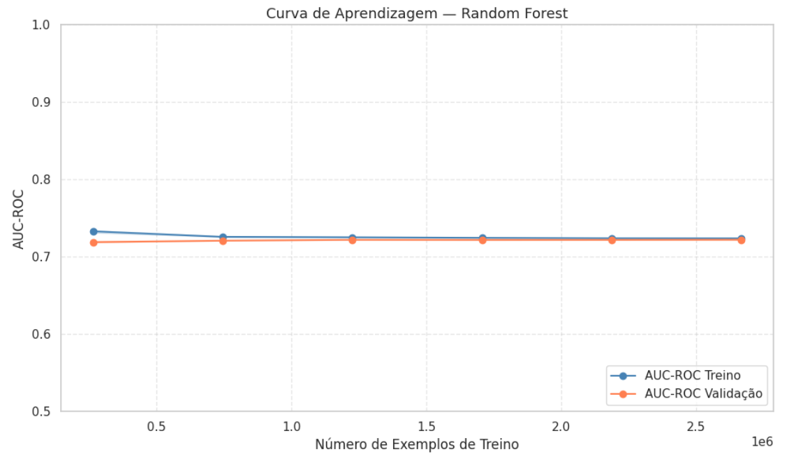
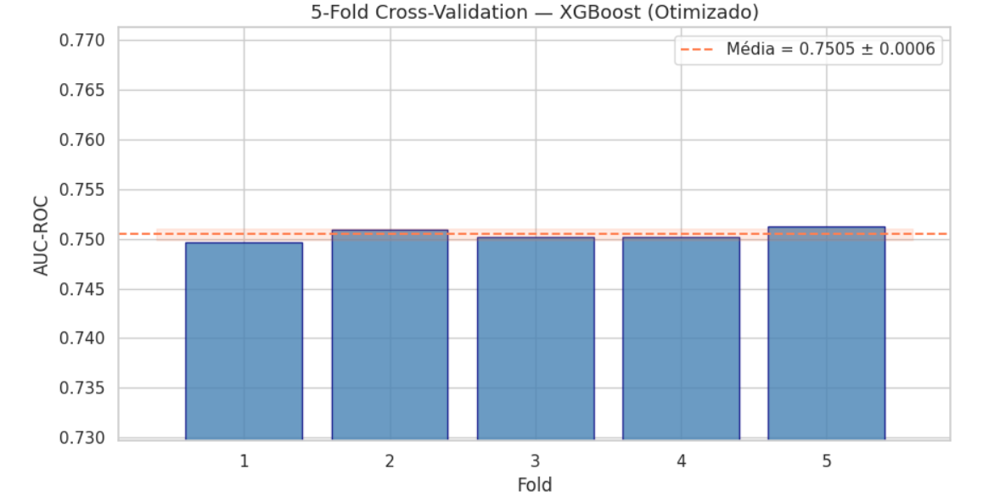

# Milestone 3: Modelação e Avaliação

## 1. Estratégia de Modelação

**Divisão do dataset:** Utilizámos uma divisão de 80% para treino (4.000.000 registos) e 20% para teste (1.000.000 registos), com `stratify=y` e `random_state=42`.

A estratificação garante que a proporção de cliques se mantém igual em ambos os conjuntos, o que é essencial dado o desequilíbrio da variável alvo. O conjunto de teste foi isolado desde o início e apenas utilizado para avaliar o desempenho final dos modelos.

O dataset utilizado nesta fase corresponde ao conjunto processado na Milestone 2, com **5.000.000 registos × 21 colunas**, incluindo a variável alvo `click` e 20 variáveis explicativas.

As variáveis categóricas de alta cardinalidade foram previamente transformadas através de **Label Encoding**, conforme implementado no notebook, permitindo que categorias como `site_id`, `site_domain`, `site_category`, `app_id`, `app_domain`, `app_category` e `device_model` fossem utilizadas pelos algoritmos de aprendizagem automática.

O `StandardScaler` foi aplicado no contexto da Regressão Logística, por ser um modelo sensível à escala das variáveis. O escalonamento foi ajustado exclusivamente no conjunto de treino (`fit_transform`) e depois aplicado ao conjunto de teste (`transform`), evitando fuga de informação.

```text
Treino : 4.000.000 registos (80%)
Teste  : 1.000.000 registos (20%)

Proporção de cliques no treino : 0.1697
Proporção de cliques no teste  : 0.1697

Proporções consistentes — divisão estratificada correcta.
Isolamento garantido: X_test nunca será visto durante o treino nem o tuning.
```
**Métrica de Sucesso:** A métrica principal escolhida foi o **AUC-ROC**, por três razões principais: é adequada para problemas de classificação binária, é robusta ao desequilíbrio de classes e mede a capacidade do modelo para ordenar impressões por probabilidade de clique.

Esta escolha é particularmente importante no contexto de publicidade digital e *Real-Time Bidding*, onde o objetivo não é apenas classificar uma impressão como clique ou não-clique, mas sim atribuir uma pontuação de probabilidade que permita priorizar oportunidades com maior potencial de interação.

O **F1-Score** foi definido como métrica secundária porque equilibra Precisão e *Recall*, sendo relevante num cenário em que tanto os Falsos Positivos como os Falsos Negativos têm impacto prático. Os Falsos Positivos representam impressões classificadas como promissoras mas que não geram clique, enquanto os Falsos Negativos representam oportunidades reais de clique que o modelo não conseguiu identificar.

A *Accuracy* foi excluída como métrica principal porque seria enganadora neste problema. Como cerca de 83% dos registos correspondem a não-cliques, um modelo que previsse sempre “não clique” teria uma taxa de acerto elevada, mas sem utilidade prática para o objetivo do projeto.

---

## 2. Experiências Realizadas

### 2.1. Modelo *Baseline* — Regressão Logística

**Algoritmo:** Regressão Logística com `class_weight='balanced'`, `max_iter=1000`, `random_state=42` e `StandardScaler` aplicado antes do treino.

```python
baseline = LogisticRegression(
    max_iter=1000,
    random_state=42,
    n_jobs=-1,
    class_weight='balanced'
)
```
O modelo *baseline* teve como objetivo criar um ponto de comparação simples e interpretável. A utilização de `class_weight='balanced'` permitiu compensar parcialmente o desequilíbrio entre cliques e não-cliques, atribuindo maior peso à classe minoritária.

O `StandardScaler` foi ajustado apenas no conjunto de treino e depois aplicado ao conjunto de teste, garantindo que o conjunto de teste não influenciava a preparação dos dados.

**Resultado:** Segundo o notebook, a Regressão Logística apresentou um desempenho estável, mas limitado, com AUC-ROC próximo de **0,62**. A curva de aprendizagem mostrou convergência entre treino e validação, indicando ausência de *overfitting*. No entanto, o desempenho ficou abaixo dos modelos mais complexos, confirmando que um modelo linear simples não consegue captar totalmente as relações não lineares presentes nos dados.


```text
Modelo Baseline: Regressão Logística
AUC-ROC aproximado: 0.62
Diagnóstico: estável, sem sinais relevantes de overfitting
```

O *baseline* estabelece o patamar mínimo: qualquer modelo candidato deve superar este desempenho para justificar a sua complexidade adicional.


---

### 2.2. Modelos Candidatos

Após o modelo *baseline*, foram testados dois modelos de maior complexidade:

1. **Random Forest**
2. **XGBoost**

Estes modelos foram escolhidos por serem adequados a problemas de classificação com relações não lineares e por lidarem bem com variáveis numéricas e categóricas previamente codificadas.

#### Random Forest

O Random Forest foi treinado com 100 árvores, profundidade máxima de 10 e ponderação das classes.

```python
rf = RandomForestClassifier(
    n_estimators=100,
    max_depth=10,
    random_state=42,
    n_jobs=-1,
    class_weight='balanced'
)
```

Segundo o notebook, o Random Forest apresentou uma melhoria clara face à Regressão Logística, estabilizando num patamar de AUC-ROC aproximado de **0,725**. A curva de aprendizagem revelou boa generalização, com diferença reduzida entre treino e validação.

#### XGBoost

O XGBoost foi treinado como principal modelo candidato, usando 200 estimadores, profundidade máxima de 6, taxa de aprendizagem de 0.1 e `scale_pos_weight` para compensar o desequilíbrio da classe positiva.

```python
xgb = XGBClassifier(
    n_estimators=200,
    max_depth=6,
    learning_rate=0.1,
    scale_pos_weight=scale_pos_weight,
    eval_metric='auc',
    random_state=42,
    n_jobs=-1,
    verbosity=0
)
```

O XGBoost apresentou o melhor desempenho entre os modelos candidatos antes do *tuning*, com AUC-ROC de teste de **0,7413**, sendo por isso selecionado para a fase de otimização.

| Algoritmo | Parâmetros Base | AUC-ROC (Teste) | Notas |
| :--- | :--- | :---: | :--- |
| Regressão Logística | `class_weight='balanced'`, `max_iter=1000` | ≈ 0.6202 | Modelo baseline; estável, mas limitado |
| Random Forest | `n_estimators=100`, `max_depth=10`, `class_weight='balanced'` | ≈ 0.725 | Boa generalização e melhoria face ao baseline |
| **XGBoost** | `n_estimators=200`, `max_depth=6`, `learning_rate=0.1` | **0.7413** | Melhor modelo candidato; selecionado para tuning |




A comparação mostrou que os modelos baseados em árvores superaram claramente a Regressão Logística. O XGBoost destacou-se por apresentar o melhor equilíbrio entre desempenho e capacidade de generalização, justificando a sua seleção para a etapa de otimização.

---

## 3. Otimização (*Tuning*)

**Técnica Utilizada:** Utilizámos *RandomizedSearchCV* com 20 iterações e `StratifiedKFold` com 5 *folds*, aplicado ao modelo XGBoost.

```python
cv_estratificada = StratifiedKFold(
    n_splits=5,
    shuffle=True,
    random_state=42
)

random_search = RandomizedSearchCV(
    estimator=modelo_base_tuning,
    param_distributions=param_dist,
    n_iter=20,
    scoring='roc_auc',
    cv=cv_estratificada,
    random_state=42,
    n_jobs=-1,
    verbose=1,
    return_train_score=True
)
```

Optámos por *RandomizedSearchCV* em vez de *GridSearchCV* porque o espaço de hiperparâmetros era amplo e uma pesquisa exaustiva seria computacionalmente pesada com 4.000.000 de registos no conjunto de treino.

O espaço de pesquisa incluiu os seguintes hiperparâmetros:

```python
param_dist = {
    'n_estimators': randint(100, 400),
    'max_depth': randint(4, 10),
    'learning_rate': uniform(0.01, 0.2),
    'subsample': uniform(0.6, 0.4),
    'colsample_bytree': uniform(0.6, 0.4),
    'min_child_weight': randint(1, 10)
}
```

Estes hiperparâmetros controlam aspetos fundamentais do XGBoost:

| Hiperparâmetro | Função |
| :--- | :--- |
| `n_estimators` | Número de árvores do modelo |
| `max_depth` | Profundidade máxima de cada árvore |
| `learning_rate` | Taxa de aprendizagem |
| `subsample` | Fração de registos usada em cada árvore |
| `colsample_bytree` | Fração de variáveis usada em cada árvore |
| `min_child_weight` | Peso mínimo necessário para criar um nó folha |

**Melhoria obtida:** Após a sintonização, o modelo otimizado alcançou um AUC-ROC de **0,7528**, representando uma melhoria de **+0,0115** face ao XGBoost base.

```text
XGBoost base       : AUC-ROC Teste = 0.7413
XGBoost otimizado  : AUC-ROC Teste = 0.7528
Melhoria obtida    : +0.0115
```

A melhoria acumulada face à Regressão Logística foi de aproximadamente **+0,1326**, confirmando que a complexidade adicional do XGBoost trouxe valor estatístico e prático ao projeto.

| Modelo | AUC-ROC (Teste) | Melhoria |
| :--- | :---: | :---: |
| Regressão Logística | ≈ 0.6202 | — |
| Random Forest | ≈ 0.725 | Melhoria face ao baseline |
| XGBoost base | 0.7413 | Melhor modelo antes do tuning |
| **XGBoost otimizado** | **0.7528** | **+0.0115 face ao XGBoost base** |

O objetivo SMART definido na Milestone 1 foi alcançado, uma vez que o modelo final ultrapassou o limiar mínimo de **AUC-ROC ≥ 0.75**.

---

## 4. Avaliação do Modelo Final

O modelo final selecionado foi o **XGBoost otimizado**, por apresentar o melhor AUC-ROC no conjunto de teste e uma boa estabilidade em validação cruzada.

A validação cruzada de 5 dobras confirmou a estabilidade do modelo, apresentando uma média de **0,7517** e um desvio padrão de **0,0007**.

```text
Validação cruzada: StratifiedKFold com 5 folds
Média AUC-ROC    : 0.7517
Desvio padrão    : 0.0007
```

O desvio padrão muito baixo indica que o desempenho é consistente entre diferentes divisões do conjunto de treino. Assim, os resultados não parecem depender de uma divisão específica dos dados, reforçando a robustez da solução.



---

### 4.1. Matriz de Confusão / Erros

A matriz de confusão foi utilizada para analisar o comportamento do modelo final em termos de acertos e erros por classe.

Segundo o notebook, o modelo final apresentou:

```text
Precisão : ≈ 0.31
Recall   : 0.6651
F1-Score : ≈ 0.423
```

A **Precisão** de aproximadamente 0,31 indica que, entre os casos classificados como clique, cerca de 31% corresponderam efetivamente a cliques reais. Isto revela a existência de um número considerável de **Falsos Positivos**.

O **Recall** de 0,6651 indica que o modelo conseguiu identificar cerca de 66,5% dos cliques reais. Este resultado é relevante no contexto de publicidade digital, porque permite capturar uma parte significativa das oportunidades reais de interação.

O **F1-Score** aproximado de 0,423 mostra que o modelo atinge um compromisso razoável entre Precisão e Recall, embora ainda exista margem para melhoria.

| Tipo de erro | Interpretação | Impacto prático |
| :--- | :--- | :--- |
| Falso Positivo (FP) | O modelo prevê clique, mas o utilizador não clica | Pode gerar desperdício de orçamento em impressões pouco eficazes |
| Falso Negativo (FN) | O modelo prevê não-clique, mas o utilizador clica | Representa uma oportunidade real de clique que foi ignorada |

> **Análise:** O modelo privilegia a deteção de cliques reais, evidenciada pelo Recall de 0,6651. Esta característica pode ser útil em campanhas onde perder oportunidades de clique é mais prejudicial do que fazer algumas previsões excessivamente otimistas. No entanto, a Precisão de aproximadamente 0,31 mostra que o modelo ainda gera muitos falsos positivos, o que pode representar desperdício de orçamento publicitário.

A análise de diagnóstico do notebook revelou que as variáveis `C16` e `banner_pos` são diferenciadoras entre cliques corretamente detetados e cliques falhados. Isto sugere que o modelo tem maior dificuldade em prever cliques associados a determinados formatos ou posições de anúncio.

Além disso, a probabilidade média dos Falsos Negativos foi indicada como **0,3466**, sugerindo que estes casos são naturalmente ambíguos e se encontram relativamente próximos do limiar de decisão. Por isso, uma melhoria futura relevante seria testar diferentes *thresholds* de decisão, em vez de utilizar apenas o limiar padrão de 0,5.


---

### 4.2. Curvas ROC

As curvas ROC foram utilizadas para comparar visualmente a capacidade dos modelos em distinguir entre cliques e não-cliques.

A curva do XGBoost otimizado demonstrou a melhor capacidade discriminativa entre os modelos testados, aproximando-se mais do canto superior esquerdo do gráfico. Isto confirma que a otimização de hiperparâmetros melhorou a capacidade do modelo para maximizar a taxa de verdadeiros positivos, controlando simultaneamente a taxa de falsos positivos.

O AUC-ROC final de **0,7528** significa que o modelo tem uma boa capacidade de ordenação: ao comparar uma impressão que gerou clique com outra que não gerou clique, o modelo tende a atribuir maior probabilidade à impressão clicada em cerca de 75% dos casos.


---

### 4.3. Importância dos Atributos (*Feature Importance*)

Foi analisada a importância das variáveis no modelo XGBoost otimizado através de `feature_importances_`.

Segundo o notebook, a variável **`C16`** foi identificada como a mais decisiva do modelo, seguida por variáveis associadas ao contexto visual e categórico do anúncio, como **`banner_area`** e **`app_category`**.

1. `C16` — variável associada à dimensão/configuração visual do anúncio.
2. `banner_area` — variável criada no projeto, calculada como `C15 × C16`.
3. `app_category` — categoria da aplicação onde o anúncio foi exibido.
4. Outras variáveis contextuais do anúncio e da aplicação.
5. Variáveis associadas ao dispositivo e ao ambiente de exibição.

A presença de `banner_area` entre as variáveis mais importantes valida a etapa de engenharia de atributos realizada na Milestone 2. Esta variável foi criada para representar a área visual do anúncio e revelou-se útil para o modelo final.

A importância de `C16` e `banner_area` sugere que o formato visual do anúncio tem um peso relevante na previsão do clique. A presença de `app_category` indica que o contexto da aplicação onde o anúncio é apresentado também influencia a probabilidade de interação.

Em termos de negócio, estes resultados indicam que a probabilidade de clique não depende apenas do utilizador ou do dispositivo, mas também do formato do anúncio e do ambiente onde este é exibido.


---

## 5. Conclusão da Fase de Modelação

O XGBoost otimizado está pronto para ser apresentado como solução final pelas seguintes razões:

- **AUC-ROC = 0,7528 ✓** — supera o objetivo SMART definido no Milestone 1, que exigia AUC-ROC mínimo de 0,75.
- **Melhoria face ao baseline** — o desempenho aumentou aproximadamente **+0,1326** face à Regressão Logística.
- **Robustez confirmada** — a validação cruzada apresentou média de **0,7517** e desvio padrão de apenas **0,0007**, indicando estabilidade entre diferentes divisões dos dados.
- **Superioridade justificada** — o XGBoost superou a Regressão Logística e o Random Forest, justificando a sua maior complexidade computacional.
- **Validação da engenharia de atributos** — a variável `banner_area`, criada na Milestone 2, surgiu entre as variáveis relevantes do modelo final.
- **Interpretação de erros realizada** — a matriz de confusão e o diagnóstico dos Falsos Negativos mostraram que ainda existe margem de melhoria, especialmente através do ajuste do *threshold* de decisão.

Apesar do bom desempenho, o modelo não deve ser interpretado como perfeito. A Precisão aproximada de 0,31 mostra que muitas previsões positivas não resultam em clique. Por outro lado, o Recall de 0,6651 demonstra que o modelo consegue captar uma parte relevante dos cliques reais, o que é importante no contexto de campanhas digitais.

Como melhoria futura, recomenda-se testar diferentes limiares de decisão, analisar a curva Precision-Recall e calibrar as probabilidades previstas pelo modelo. Estas melhorias podem ajudar a adaptar o modelo a diferentes estratégias de negócio, consoante seja mais importante reduzir falsos positivos ou minimizar falsos negativos.

---

*Data de última atualização: 23/04/2026*
