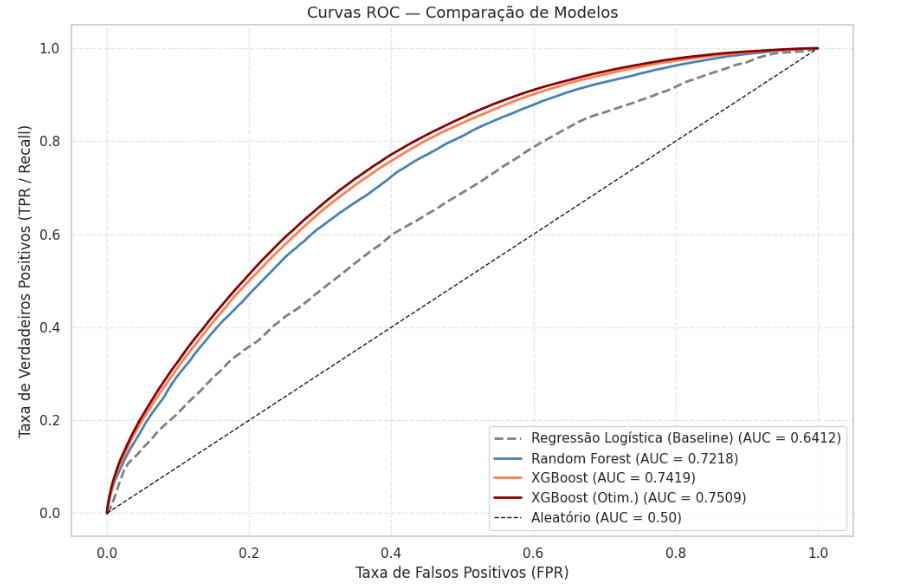
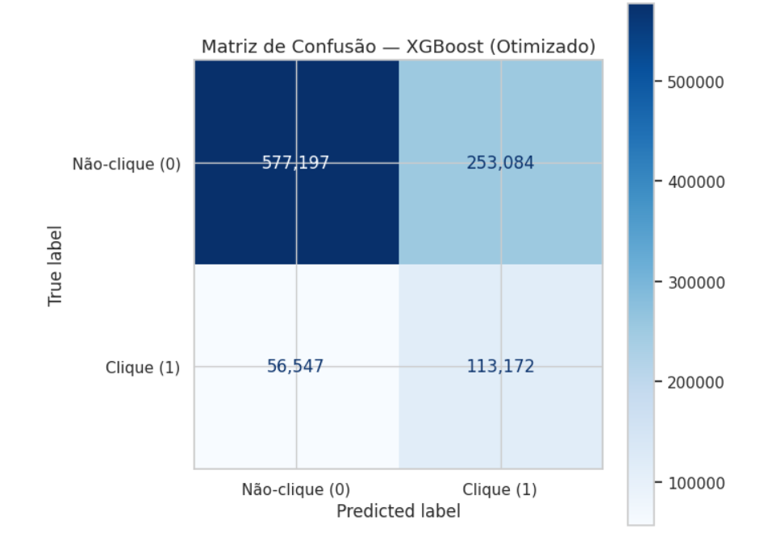
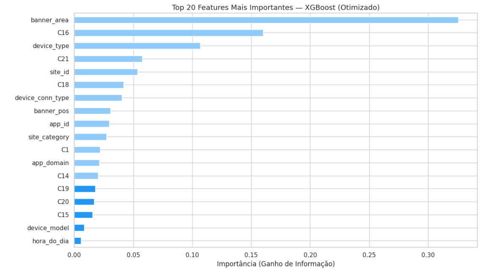

# Relatório de Conclusão e Entrega de Valor (Milestone 4)

## 1. Síntese de Resultados e Impacto

> **Nota:** Esta secção deve traduzir as métricas técnicas (F1-Score, RMSE, Silhouette, Lift) em
resultados compreensíveis para qualquer pessoa.

* **O Problema Resolvido:**  

O problema definido na Milestone 1 consistia em desenvolver um modelo de classificação binária capaz de prever se uma impressão publicitária iria ou não gerar clique. A variável alvo do projeto é `click`, em que `0` representa “não clique” e `1` representa “clique”. Este problema foi trabalhado com o conjunto de dados **Avazu CTR Prediction**, composto por registos reais de impressões de anúncios digitais.

A relevância do problema está ligada ao contexto da publicidade digital e do *Real-Time Bidding* (RTB). Neste tipo de ambiente, os anunciantes precisam de tomar decisões rápidas sobre onde investir o orçamento disponível. Se todas as impressões forem tratadas como igualmente relevantes, existe maior risco de desperdiçar investimento em anúncios com baixa probabilidade de interação. Por isso, prever a probabilidade de clique permite apoiar decisões mais informadas e melhorar a eficiência das campanhas digitais.

A Milestone 1 definiu dois objetivos principais. O primeiro era desenvolver um modelo capaz de atingir pelo menos **AUC-ROC = 0.75** no conjunto de teste. O segundo era identificar as **5 variáveis mais determinantes** para a previsão do clique e diagnosticar os principais perfis de erro do modelo.

Estes objetivos foram alcançados. Na fase de modelação, o modelo final escolhido foi o **XGBoost otimizado**, que obteve **AUC-ROC = 0.7509** no conjunto de teste, ultrapassando o objetivo mínimo definido. A análise de importância dos atributos também permitiu identificar as variáveis com maior peso na previsão: `banner_area`, `C16`, `device_type`, `C21` e `site_id`.

A ligação entre as milestones é direta. Na Milestone 1 foi definido o problema de negócio e o objetivo de previsão. Na Milestone 2, os dados foram analisados, limpos e transformados, incluindo o tratamento de `C20`, a remoção de identificadores pouco úteis e a criação de novas variáveis como `hora_do_dia` e `banner_area`. Na Milestone 3, foram testados modelos de classificação, comparando Regressão Logística, Random Forest e XGBoost, sendo o XGBoost otimizado escolhido como modelo final. A Milestone 4 fecha o ciclo ao traduzir estes resultados em valor prático, limitações, implicações éticas e próximos passos.

*Figura 1 (Curvas ROC comparativas dos modelos testados). Esta figura deve ser usada para mostrar visualmente que o XGBoost otimizado apresenta melhor capacidade discriminativa do que o modelo baseline.*

* **Interpretação dos Resultados:**  

O resultado principal do projeto foi o **AUC-ROC = 0.7509** obtido pelo XGBoost otimizado. Em linguagem simples, isto significa que o modelo tem uma boa capacidade para ordenar impressões publicitárias por probabilidade de clique. Ou seja, quando compara uma impressão que gerou clique com outra que não gerou clique, o modelo tende a atribuir uma pontuação mais elevada à impressão que realmente foi clicada.

Este resultado é especialmente relevante porque o conjunto de dados está fortemente desequilibrado: cerca de **83%** dos registos correspondem a não-cliques e apenas cerca de **17%** correspondem a cliques. Neste contexto, a *Accuracy* seria enganadora, porque um modelo que previsse sempre “não clique” teria uma taxa de acerto elevada, mas não teria utilidade prática para identificar oportunidades reais de clique. Por isso, o **AUC-ROC** foi a métrica principal, e o **F1-Score** foi usado como métrica secundária.

O **F1-Score = 0.4223** mostra que o modelo consegue algum equilíbrio entre identificar cliques reais e controlar previsões positivas erradas. Este valor não deve ser interpretado isoladamente como “baixo” ou “alto” sem considerar o desequilíbrio da variável alvo. Como os cliques representam apenas uma minoria dos registos, é natural que seja difícil obter simultaneamente elevada Precisão e elevado *Recall*. Ainda assim, o modelo final melhora claramente o desempenho do *baseline*.

A comparação com a Regressão Logística confirma esta melhoria. O modelo *baseline* obteve **AUC-ROC = 0.6412** no conjunto de teste, enquanto o XGBoost otimizado atingiu **0.7509**. Isto representa uma melhoria acumulada de **+0.1097** em AUC-ROC. Esta diferença justifica a escolha de um modelo mais complexo, porque o ganho de desempenho é relevante para o objetivo do projeto.

A validação cruzada também reforçou a estabilidade do modelo. O XGBoost otimizado apresentou média de **0.7504** e desvio padrão de **0.0006** em validação cruzada de 5 *folds*. Isto indica que o desempenho não depende apenas de uma divisão favorável dos dados, mas sim de um comportamento consistente do modelo.

A matriz de confusão permite interpretar os erros de forma mais concreta. O modelo identificou corretamente **577.197 não-cliques** e **113.172 cliques reais**. No entanto, também classificou **253.084 impressões** como potenciais cliques quando, na realidade, não geraram interação, e falhou **56.547 cliques reais**.

*Figura 2 (Matriz de confusão do modelo final). Esta figura deve ser usada para explicar os acertos e erros do XGBoost otimizado: Verdadeiros Negativos, Falsos Positivos, Falsos Negativos e Verdadeiros Positivos.*

Em termos práticos, os **Falsos Positivos** representam impressões previstas como clique, mas que não foram clicadas. Num cenário real, isto pode traduzir-se em orçamento desperdiçado. Já os **Falsos Negativos** representam impressões que geraram clique, mas que o modelo não conseguiu identificar como oportunidades promissoras. Estes casos correspondem a oportunidades reais perdidas.

A análise de importância dos atributos mostra ainda que a variável `banner_area`, criada durante a Milestone 2, foi a mais importante no modelo final, com importância de **0.326**. Este resultado valida a etapa de engenharia de atributos, porque uma variável criada a partir das dimensões do anúncio (`C15 × C16`) acabou por ser central para a previsão. Também se destacaram `C16`, `device_type`, `C21` e `site_id`.

*Figura 3 (Importância dos atributos no XGBoost otimizado). Esta figura deve ser usada para mostrar que o modelo não depende apenas de uma variável, mas que o formato visual do anúncio e o contexto de exibição têm peso relevante na previsão.*

Assim, a conclusão principal não é apenas que o modelo “tem AUC-ROC de 0.7509”. A conclusão real é que o modelo consegue ordenar impressões por probabilidade de clique melhor do que o *baseline*, que a engenharia de atributos contribuiu para o desempenho final e que variáveis associadas ao formato visual do anúncio e ao contexto de exibição têm impacto relevante na previsão.

* **Valor para o Utilizador/Negócio:**  

O valor prático deste projeto está em transformar dados históricos de publicidade digital numa ferramenta de apoio à decisão. Em vez de tratar todas as impressões como iguais, o modelo permite atribuir uma pontuação de probabilidade de clique a cada impressão. Isto pode ajudar anunciantes e plataformas a priorizar oportunidades com maior potencial de interação.

Na prática, esta solução pode ser usada para apoiar decisões de licitação em campanhas digitais. Se uma impressão tiver maior probabilidade prevista de clique, pode justificar um lance mais competitivo. Se tiver menor probabilidade prevista de clique, o anunciante pode optar por não investir tanto nessa oportunidade. Desta forma, o modelo pode contribuir para reduzir desperdício de orçamento em impressões pouco promissoras.

O modelo também produz conhecimento acionável. A importância elevada de `banner_area` indica que o formato visual do anúncio é um fator relevante. A presença de `C16` reforça a importância das dimensões ou da configuração visual do anúncio. A presença de `device_type` mostra que o tipo de dispositivo influencia a probabilidade de clique. A presença de `site_id` indica que o contexto onde o anúncio é apresentado também tem peso na previsão.

Contudo, o valor do modelo deve ser interpretado com prudência. O modelo prevê cliques, mas não prevê diretamente conversões, compras ou receita. Um clique pode ser útil, mas não garante retorno financeiro. Por isso, a solução é valiosa como ferramenta de priorização e apoio à decisão, mas não deve ser vista como uma garantia automática de rentabilidade.

Em resumo, o projeto entrega valor porque responde às três perguntas essenciais da Milestone 4:

1. **O que é que isto resolve?** Ajuda a prever quais impressões têm maior probabilidade de clique.
2. **Posso confiar nestes números?** O modelo foi comparado com um *baseline*, testado em conjunto de teste e validado com *cross-validation*.
3. **E agora, o que fazemos com isto?** Podemos usar a probabilidade prevista para apoiar decisões de investimento em publicidade digital, ajustar estratégias de campanha e orientar trabalho futuro.

## 2. Análise Crítica e Limitações

> **Nota:** Identificar de forma honesta as fronteiras do projeto e onde o modelo pode falhar.

* **Limitações dos Dados:**  

A primeira limitação está relacionada com a dimensão trabalhada. O conjunto de dados original Avazu contém cerca de **40 milhões de registos**, mas o projeto utilizou uma amostra de **5.000.000 registos** por razões de viabilidade computacional. Esta amostra permitiu desenvolver o projeto de forma reprodutível e viável no ambiente de trabalho, mas não representa a totalidade dos dados disponíveis.

A segunda limitação é o forte desequilíbrio da variável alvo. Apenas cerca de **17%** dos registos correspondem a cliques, enquanto cerca de **83%** correspondem a não-cliques. Este desequilíbrio torna a identificação da classe minoritária mais difícil e explica por que razão métricas como *Accuracy* não são adequadas como indicador principal de sucesso.

A terceira limitação é a existência de variáveis anonimizadas, como `C14` a `C21`. Estas variáveis foram analisadas, tratadas e usadas na modelação quando acrescentavam valor preditivo. Por exemplo, `C20` exigiu tratamento porque tinha valores `-1` como marcador de ausência de informação, e `C17` foi removida por multicolinearidade. No entanto, por serem variáveis anónimas, nem sempre é possível traduzir o seu significado técnico em recomendações de negócio totalmente específicas.

A quarta limitação está relacionada com o período temporal dos dados. O conjunto de dados Avazu corresponde a registos de publicidade recolhidos ao longo de um período específico. Comportamentos dos utilizadores, formatos de anúncio, aplicações, sites e estratégias de campanha podem mudar ao longo do tempo. Assim, o desempenho do modelo pode diminuir se for aplicado a dados muito diferentes dos dados usados no treino.

A quinta limitação é que o projeto prevê cliques, não conversões. A variável alvo `click` indica se houve ou não clique, mas não indica se o utilizador comprou, subscreveu, registou-se ou gerou receita. Por isso, o modelo otimiza uma etapa intermédia do funil publicitário, mas não mede diretamente o retorno final da campanha.

* **Limitações do Modelo:**  

O XGBoost otimizado foi o melhor modelo testado e cumpriu o objetivo SMART, mas não é uma solução perfeita. O **AUC-ROC = 0.7509** mostra boa capacidade de ordenação, mas não significa que o modelo acerte todas as previsões individuais.

O **F1-Score = 0.4223** mostra que existe margem de melhoria no equilíbrio entre Precisão e *Recall*. Este resultado é compreensível num conjunto de dados fortemente desequilibrado, mas revela que o modelo ainda tem dificuldade em separar totalmente cliques de não-cliques.

A matriz de confusão confirma esta limitação. Os **253.084 Falsos Positivos** indicam que o modelo ainda classifica muitas impressões como potenciais cliques sem que estas gerem interação. Num cenário real, isto pode levar a investimento em impressões menos eficientes. Os **56.547 Falsos Negativos** indicam que o modelo também perde oportunidades reais de clique.

Outra limitação é que o modelo identifica associações estatísticas, mas não prova causalidade. Por exemplo, `banner_area` foi a variável mais importante, mas isso não permite afirmar que aumentar sempre a área do anúncio irá causar automaticamente mais cliques. A interpretação correta é que, nos dados analisados, a área visual do anúncio ajudou o modelo a prever melhor a probabilidade de clique.

Também é importante reconhecer que o XGBoost é mais complexo do que a Regressão Logística. Embora tenha melhor desempenho, é menos simples de explicar. A análise de *Feature Importance* ajuda a interpretar o modelo, mas não torna todas as decisões totalmente transparentes.

* **Contextos de Falha:**  

O modelo pode falhar quando aplicado a contextos diferentes dos dados de treino. Exemplos incluem novos sites, novas aplicações, novos dispositivos, novos formatos de anúncio ou campanhas com públicos-alvo diferentes dos observados na amostra.

O modelo também pode ter menor fiabilidade em categorias raras. Se um determinado `site_id`, `app_id`, tipo de dispositivo ou configuração de anúncio aparece poucas vezes nos dados, o modelo pode não ter exemplos suficientes para aprender um padrão robusto.

Outro contexto de falha está associado ao limiar de decisão. O modelo produz probabilidades, mas a decisão final de classificar uma impressão como “clique provável” ou “não clique provável” depende de um limiar. Um limiar mais baixo pode aumentar o *Recall*, captando mais cliques reais, mas também pode aumentar os Falsos Positivos. Um limiar mais alto pode reduzir desperdício, mas também pode perder mais oportunidades reais de clique.

Por isso, o modelo não deve ser aplicado de forma automática e igual em todos os contextos. A escolha do limiar deve depender da estratégia da campanha. Se o objetivo for maximizar alcance e captar mais oportunidades, pode fazer sentido aceitar mais Falsos Positivos. Se o objetivo for controlar rigorosamente o orçamento, pode ser preferível reduzir previsões positivas e aceitar perder alguns cliques.

## 3. Considerações Éticas e de Viés

* **Privacidade:**  

O conjunto de dados utilizado é anonimizado e não contém nomes, contactos ou identificadores pessoais diretos. Além disso, variáveis como `id`, `device_id` e `device_ip` foram removidas durante o pré-processamento, por terem elevada cardinalidade e baixo poder de generalização.

Esta remoção também reduz riscos associados ao uso de identificadores individuais. O modelo final trabalha com padrões agregados relacionados com contexto, dispositivo, formato do anúncio e ambiente de exibição, sem procurar identificar pessoas concretas.

Ainda assim, é necessário cuidado. Mesmo quando os dados estão anonimizados, continuam a representar comportamentos observados. Por isso, a utilização do modelo deve limitar-se à otimização agregada de campanhas e não deve ser usada para tentar reconstruir perfis individuais de utilizadores.

Também deve existir cuidado na forma como os resultados são usados. O facto de um determinado contexto ter maior probabilidade de clique não significa que seja adequado aumentar indefinidamente a pressão publicitária sobre esse contexto. A otimização para cliques deve ser equilibrada com a experiência do utilizador.

* **Transparência:**  

Foram utilizadas técnicas de interpretação para tornar o modelo mais compreensível. A matriz de confusão permite perceber onde o modelo acerta e onde falha. A análise de *Feature Importance* permite identificar quais variáveis contribuíram mais para a decisão do XGBoost.

Esta transparência é importante porque evita que o modelo seja apresentado apenas como uma “caixa negra”. Sabemos que `banner_area`, `C16`, `device_type`, `C21` e `site_id` foram as variáveis com maior peso no modelo final. Sabemos também que `banner_area` foi criada durante o projeto, o que liga diretamente a engenharia de atributos da Milestone 2 ao desempenho obtido na Milestone 3.

No entanto, a transparência é parcial. Algumas variáveis do conjunto de dados são anónimas, pelo que nem sempre é possível explicar o seu significado de negócio de forma completa. Nestes casos, é mais correto dizer que a variável tem valor preditivo do que atribuir-lhe um significado não documentado.

Existe também risco de viés. O modelo aprende padrões presentes nos dados históricos. Se determinados dispositivos, sites, aplicações, horários ou formatos de anúncio estiverem sobre-representados, o modelo pode favorecer esses contextos no futuro. Por isso, numa aplicação real, seria necessário monitorizar o desempenho por segmentos e verificar se o modelo mantém qualidade de previsão em diferentes grupos de impressões.

A transparência também exige comunicar as limitações. O modelo não prevê conversão nem receita final; prevê apenas clique. Esta distinção é importante para evitar interpretações exageradas sobre o impacto financeiro direto da solução.

## 4. Roadmap e Trabalhos Futuros

2. **Novas Variáveis:**  

O modelo poderia beneficiar da integração de variáveis adicionais que não estavam disponíveis no conjunto de dados trabalhado. Uma melhoria importante seria incluir informação relacionada com o valor real do clique, como conversão, compra, registo ou receita gerada. Isto permitiria evoluir de um modelo que prevê CTR para um modelo mais próximo do retorno real da campanha.

Também seria útil incluir variáveis relacionadas com campanha e criativo, como tipo de anúncio, categoria do produto anunciado, custo por impressão, custo por clique e objetivo da campanha. Estas variáveis poderiam ajudar a distinguir cliques de maior e menor valor.

Outra linha de evolução seria enriquecer a dimensão temporal. A Milestone 2 mostrou que a hora do dia tem relevância para a CTR, mas poderiam ser adicionadas variáveis como dia da semana, feriados ou eventos externos. Isto poderia ajudar a captar padrões sazonais que não são totalmente explorados apenas com `hora_do_dia`.

Por fim, seria interessante incluir informação sobre frequência de exposição. Saber quantas vezes o mesmo utilizador ou dispositivo foi exposto a anúncios semelhantes poderia ajudar a perceber efeitos de saturação ou repetição.

3. **Escalabilidade (Deployment):**  

Como trabalho futuro, o modelo poderia ser transformado numa solução utilizável por pessoas não técnicas. Uma opção seria desenvolver uma aplicação simples em **Streamlit**, onde o utilizador pudesse carregar novos dados e obter uma probabilidade estimada de clique para cada impressão.

Para isso, seria necessário guardar o modelo final e todas as etapas de pré-processamento usadas durante o treino. Novos dados teriam de passar pelas mesmas transformações: tratamento de valores em falta, remoção de variáveis não utilizadas, codificação de variáveis categóricas e criação de variáveis como `hora_do_dia` e `banner_area`.

Outra possibilidade seria desenvolver uma interface de programação de aplicações com Flask ou FastAPI, permitindo que o modelo fosse integrado num sistema de decisão em tempo real. Esta abordagem seria mais próxima de um cenário de *Real-Time Bidding*, onde as previsões precisam de ser feitas rapidamente.

Numa fase mais avançada, a solução poderia incluir um painel de monitorização com métricas como AUC-ROC, F1-Score, Precisão, *Recall*, distribuição das probabilidades previstas e importância das variáveis ao longo do tempo. Este painel ajudaria a detetar degradação de desempenho e a perceber quando o modelo precisa de ser reavaliado ou treinado novamente.

O objetivo final do roadmap é transformar o projeto académico numa solução mais operacional: reprodutível, interpretável, monitorizável e útil para apoiar decisões de campanhas digitais.

**Data de Conclusão:** 15/05/2026  
**Versão do Projeto:** v4.0 Final
